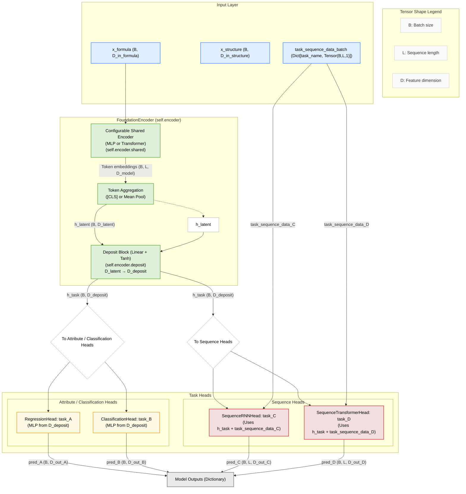
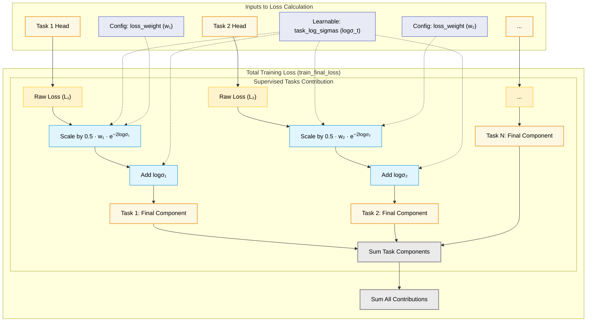

## Project Structure

```
foundation_model/
├── src/
│   └── foundation_model/    # Main Python package
│       ├── models/          # Neural network models and components
│       │   ├── components/  # Reusable model parts (encoders, fusion, SSL)
│       │   └── task_head/   # Task-specific prediction heads (regression, classification, sequence)
│       ├── data/            # Data handling (Dataset, DataModule, splitter)
│       ├── utils/           # Utility functions (plotting, training helpers)
│       ├── configs/         # Configuration models
│       └── scripts/         # Execution scripts (e.g., train.py)

├── data/                    # Placeholder for larger, persistent datasets (e.g., raw data)
│
├── results/                 # Default output directory for models, logs, figures
│
├── notebooks/               # Jupyter notebooks for experiments, analysis, and visualization
│   └── experiments/         # Older experimental notebooks
│
├── samples/                 # Example configurations, data, and helper scripts
│   ├── cli_examples/        # Shell script examples for CLI usage
│   ├── fake_data/           # Small fake datasets for testing
│   ├── generated_configs/   # Example generated YAML configurations
│   └── helper_tools/        # Utility scripts for data/config generation
│
├── .gitignore
├── .python-version
├── ARCHITECTURE.md          # Detailed model architecture documentation
├── CHANGES.md               # Changelog
├── pyproject.toml           # Project metadata and dependencies
├── README.md                # This file
└── uv.lock                  # uv lock file
```

# Model Architecture Documentation

This document provides a detailed overview of the `FlexibleMultiTaskModel` architecture, its components, and data flow.

## Detailed Architecture Diagram

The following diagram illustrates the comprehensive structure of the `FlexibleMultiTaskModel`, including support for multi-modal inputs (formula and structure), various task heads (regression, classification, sequence), and internal data pathways.



## Component Explanations

### 1. Input Layer
The model can accept several types of inputs:
-   **`x_formula`**: Tensor representing formula-based features (e.g., chemical composition, elemental descriptors). Shape: `(BatchSize, D_in_formula)`. This is the primary input.
-   **`task_sequence_data_batch`** (Optional): A dictionary where keys are sequence task names and values are tensors representing sequence input data (e.g., temperatures, time steps) for those tasks. Shape of each tensor: `(BatchSize, SequenceLength, NumFeaturesPerPoint)` (typically `(B,L,1)`).

### 2. Foundation Encoder (`self.encoder`)
This is the core shared part of the model. It processes formula descriptors with a configurable backbone and produces task-ready representations. The behavior is driven by `encoder_config`, which declares its mode with the `EncoderType` enum (`encoder_config.type`) defined in `model_config.py`.

-   **`shared` (Configurable Backbone)**: Projects `x_formula` into a latent space.
    -   **MLP Mode** (`MLPEncoderConfig`): Applies the feed-forward stack defined by `hidden_dims`, optional normalization, and residual settings. The final hidden size becomes `latent_dim`.
    -   **Transformer Mode** (`TransformerEncoderConfig`): Treats each scalar feature as a token, learns per-token embeddings, and runs a stack of Transformer encoder blocks. Token outputs are aggregated through either a learnable `[CLS]` token or mean pooling depending on `use_cls_token`. The aggregated representation becomes `h_latent`.
-   **`deposit` (Linear + Tanh)**: Processes `h_latent`.
    -   Input: `h_latent` (dimension defined by the chosen encoder’s `latent_dim`).
    -   Output: `h_task` (task-specific input representation, dimension `D_deposit`). `D_deposit` is typically the input dimension expected by the first non-sequence task head.

The output `h_task` (from the `deposit` layer) serves as the primary contextual input for ALL task heads (Attribute, Classification, and Sequence). The `h_latent` representation is the intermediate output within the `FoundationEncoder` before the `deposit` layer, whether it originates from the final MLP layer or the Transformer aggregation.

### 3. Task Heads (`self.task_heads`)
This is an `nn.ModuleDict` containing individual prediction heads for each configured task.

-   **General Input**:
    -   All task heads (Attribute Regression, Classification, and Sequence Prediction) receive `h_task` (output of the `deposit` block) as their primary input.
    -   Sequence Prediction heads additionally receive their specific sequence data (e.g., temperature points, time steps) from `task_sequence_data_batch['task_name']`.

-   **`RegressionHead`**:
    -   Typically an MLP defined by `config.dims` (e.g., `[D_deposit, hidden_dim, 1]`).
    -   Outputs a continuous value (or vector) for each sample. Shape: `(BatchSize, D_out_regression)`.

-   **`ClassificationHead`**:
    -   Typically an MLP defined by `config.dims` (e.g., `[D_deposit, hidden_dim, num_classes]`).
    -   Outputs logits for each class. Shape: `(BatchSize, NumClasses)`.

-   **Sequence Heads (e.g., `SequenceRNNHead`, `SequenceTransformerHead`, `SequenceTCNFiLMHead`)**:
    -   These heads have more complex internal architectures (RNNs, Transformers, TCNs).
    -   They combine the contextual vector (`h_task`) with the input sequence points (`task_sequence_data_batch['task_name']`).
    -   Output a sequence of predictions. Shape: `(BatchSize, SequenceLength, D_out_sequence_point)`.

### 4. Model Outputs
The `forward` method of `FlexibleMultiTaskModel` returns a dictionary.
-   Keys: Task names as defined in `task_configs`.
-   Values: The corresponding prediction tensors from each enabled task head.

During `predict_step`, the output dictionary keys are further processed by each head's `predict` method, often resulting in keys like `task_name_value` or `task_name_probabilities`.

## Data Flow and Dimensionality Summary

-   **Input (`x_formula`)**: `(B, shared_block_dims[0])`
-   **After Formula/Shared Encoder**: `h_latent` or `h_formula` is `(B, shared_block_dims[-1])`
-   **After Structure Encoder (if applicable)**: `h_structure` is `(B, struct_block_dims[-1])` (must be same as `shared_block_dims[-1]`)
-   **After Fusion (if applicable)**: `h_fused` is `(B, shared_block_dims[-1])`
-   **After Deposit Layer**: `h_task` is `(B, D_deposit)`
-   **Regression/Classification Head Output**: `(B, task_specific_output_dim)`
-   **Sequence Head Output**: `(B, SequenceLength, task_specific_output_dim_per_point)`

This structure allows for flexible combination of shared representations with task-specific processing.

## Loss Calculation and Weighting

The `FlexibleMultiTaskModel` employs a sophisticated strategy for calculating and weighting losses from multiple supervised tasks to enable stable and effective multi-task learning. This section details the approach, including the use of learnable uncertainty weighting.

### 1. Raw Task Losses
Each individual task head (e.g., `RegressionHead`, `ClassificationHead`, `SequenceRNNHead`) computes its own "raw" loss ($\mathcal{L}_t$). This is typically a standard loss function appropriate for the task type:
-   **Regression Tasks**: Mean Squared Error (MSE) is common, often calculated on target values that may have been pre-scaled by a `target_scaler` (e.g., `StandardScaler`) for numerical stability.
-   **Classification Tasks**: Cross-Entropy Loss is typical.
-   **Sequence Tasks**: Depends on the nature of the sequence; could be MSE per time step or another sequence-appropriate loss, also potentially on scaled targets.

Self-supervised tasks (MFM, contrastive, cross-reconstruction) also compute their respective raw losses.

### 2. Learnable Uncertainty Weighting for Supervised Tasks

To address challenges with balancing tasks that may have different loss scales or learning difficulties, the model implements learnable uncertainty weighting for supervised tasks, inspired by the work of Kendall, Gal, and Cipolla, "Multi-task Learning Using Uncertainty to Weigh Losses for Scene Geometry and Semantics," CVPR 2018.

#### Conceptual Basis: Homoscedastic Uncertainty
Homoscedastic uncertainty refers to task-dependent uncertainty that is constant for all input samples of a given task but varies between tasks. The model learns these task-specific uncertainties ($\sigma_t$) and uses them to automatically balance the contribution of each task's loss.

#### Probabilistic Formulation
For a regression task $t$, modeling the likelihood $p(y_t | f_t(\mathbf{x}), \sigma_t^2)$ as a Gaussian $\mathcal{N}(y_t | f_t(\mathbf{x}), \sigma_t^2)$, the negative log-likelihood (NLL) to be minimized is proportional to:
$$ \mathcal{L}'_t = \frac{1}{2\sigma_t^2} \mathcal{L}_t + \log \sigma_t $$
where $\mathcal{L}_t = (y_t - f_t(\mathbf{x}))^2$ is the raw squared error. A similar formulation applies to classification tasks.

#### Practical Implementation
The model learns $\log \sigma_t$ for each supervised task $t$, stored in `model.task_log_sigmas`. With an optional per-task scalar `loss_weight = w_t`, the final loss component becomes:
$$ \mathcal{L}'_{t, \text{final}} = \frac{w_t \cdot \exp(-2 \log \sigma_t)}{2} \mathcal{L}_t + \log \sigma_t $$
Where:
-   $\mathcal{L}_t$: The raw, unweighted loss for task $t$.
-   $\log \sigma_t$: The learnable log uncertainty for task $t$.
-   $\exp(-2 \log \sigma_t)$: Equivalent to $1/\sigma_t^2$ (precision). If $\mathcal{L}_t$ is large (task is hard/noisy), $\log \sigma_t$ increases, down-weighting $\mathcal{L}_t$.
-   $w_t$: User-provided scalar (defaults to 1.0) that scales task $t$'s contribution.
-   The $\log \sigma_t$ term regularizes, preventing $\sigma_t$ from collapsing.

### 3. Total Loss for Optimization
The total loss optimized during training (`train_final_loss`) is:
$$ \text{train\_final\_loss} = \sum_{t \in \text{supervised}} \mathcal{L}'_{t, \text{final}} + \sum_{s \in \text{auxiliary}} \mathcal{L}'_{s, \text{final}} $$

When the uncertainty balancer is disabled, each supervised term simplifies to $w_t \cdot \mathcal{L}_t$.

Any auxiliary/self-supervised heads contribute via their own modules; if none are configured this reduces to the supervised sum above.

### 4. Validation Loss
During validation, the same weighting formulation is applied using the learned $\log \sigma_t$ values (without updating them). The primary metric for callbacks (e.g., `ModelCheckpoint`, `EarlyStopping`) is `val_final_loss`.

### Loss Calculation Flow Diagram

The following diagram illustrates the combination of different loss components:



This adaptive weighting scheme allows the model to dynamically balance the influence of different tasks based on their learned uncertainties, promoting more robust multi-task training.
