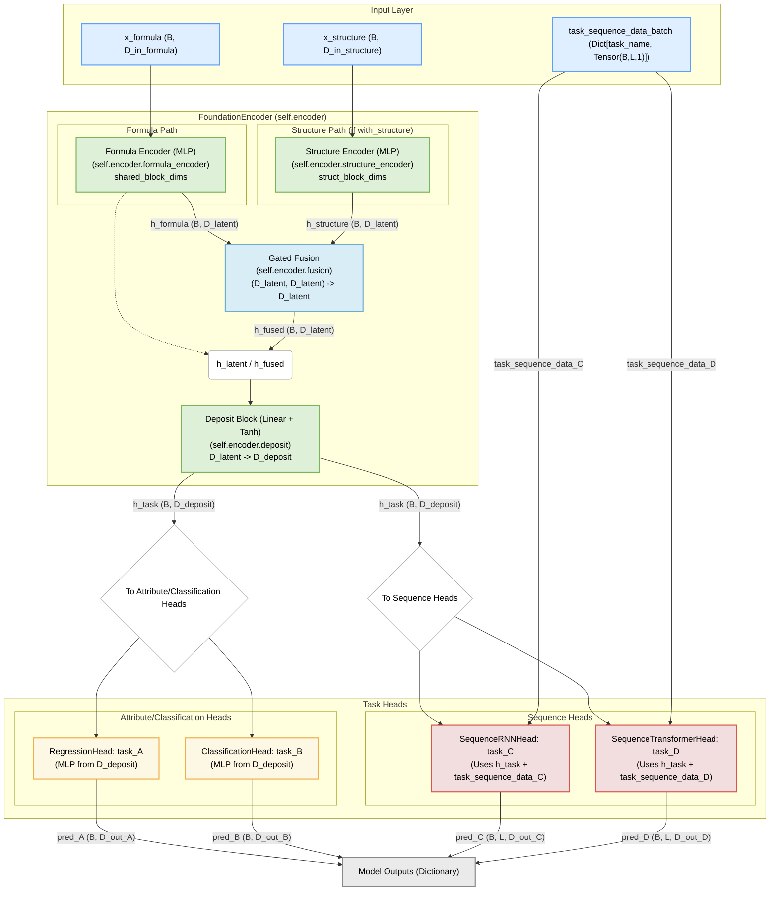

# Model Architecture Documentation

This document provides a detailed overview of the `FlexibleMultiTaskModel` architecture, its components, and data flow.

## Detailed Architecture Diagram

The following diagram illustrates the comprehensive structure of the `FlexibleMultiTaskModel`, including support for multi-modal inputs (formula and structure), various task heads (regression, classification, sequence), and internal data pathways.

## Component Explanations

### 1. Input Layer
The model can accept several types of inputs:
-   **`x_formula`**: Tensor representing formula-based features (e.g., chemical composition, elemental descriptors). Shape: `(BatchSize, D_in_formula)`. This is the primary input.
-   **`x_structure`** (Optional): Tensor representing structural features (e.g., crystal structure descriptors, graph-based features). Shape: `(BatchSize, D_in_structure)`. Used when `with_structure=True`.
-   **`task_sequence_data_batch`** (Optional): A dictionary where keys are sequence task names and values are tensors representing sequence input data (e.g., temperatures, time steps) for those tasks. Shape of each tensor: `(BatchSize, SequenceLength, NumFeaturesPerPoint)` (typically `(B,L,1)`).

### 2. Foundation Encoder (`self.encoder`)
This is the core shared part of the model. Its internal structure depends on whether `with_structure` is enabled.

-   **If `with_structure=False` (Single Modality)**:
    -   **`shared` (MLP Block)**: Processes `x_formula`.
        -   Input: `x_formula` (Dimension `D_in_formula`, which is `shared_block_dims[0]`).
        -   Hidden Layers: Defined by `shared_block_dims[1:-1]`.
        -   Output: `h_latent` (Latent representation, dimension `shared_block_dims[-1]`).
    -   **`deposit` (Linear + Tanh)**: Processes `h_latent`.
        -   Input: `h_latent` (Dimension `shared_block_dims[-1]`).
        -   Output: `h_task` (Task-specific input representation, dimension `D_deposit`). `D_deposit` is typically the input dimension expected by the first non-sequence task head.

-   **If `with_structure=True` (Multi-Modal)**:
    -   **`formula_encoder` (MLP Block)**: Same as the `shared` block above, processes `x_formula` to produce `h_formula` (Dimension `shared_block_dims[-1]`).
    -   **`structure_encoder` (MLP Block)**: Processes `x_structure`.
        -   Input: `x_structure` (Dimension `D_in_structure`, which is `struct_block_dims[0]`).
        -   Hidden Layers: Defined by `struct_block_dims[1:-1]`.
        -   Output: `h_structure` (Dimension `struct_block_dims[-1]`). **Note**: `struct_block_dims[-1]` must equal `shared_block_dims[-1]`.
    -   **`fusion` (GatedFusion)**: Combines `h_formula` and `h_structure` using a gated mechanism.
        -   Input: Concatenation of `h_formula` and `h_structure`.
        -   Output: `h_fused` (Fused latent representation, dimension `shared_block_dims[-1]`).
    -   **`deposit` (Linear + Tanh)**: Processes `h_fused`.
        -   Input: `h_fused` (Dimension `shared_block_dims[-1]`).
        -   Output: `h_task` (Task-specific input representation, dimension `D_deposit`).

The output `h_task` (from the `deposit` layer) serves as the primary contextual input for ALL task heads (Attribute, Classification, and Sequence). The `h_latent` or `h_fused` representations are intermediate outputs within the `FoundationEncoder` before the `deposit` layer.

### 3. Task Heads (`self.task_heads`)
This is an `nn.ModuleDict` containing individual prediction heads for each configured task.

-   **General Input**:
    -   All task heads (Attribute Regression, Classification, and Sequence Prediction) receive `h_task` (output of the `deposit` block) as their primary input.
    -   Sequence Prediction heads additionally receive their specific sequence data (e.g., temperature points, time steps) from `task_sequence_data_batch['task_name']`.

-   **`RegressionHead`**:
    -   Typically an MLP defined by `config.dims` (e.g., `[D_deposit, hidden_dim, 1]`).
    -   Outputs a continuous value (or vector) for each sample. Shape: `(BatchSize, D_out_regression)`.

-   **`ClassificationHead`**:
    -   Typically an MLP defined by `config.dims` (e.g., `[D_deposit, hidden_dim, num_classes]`).
    -   Outputs logits for each class. Shape: `(BatchSize, NumClasses)`.

-   **Sequence Heads (e.g., `SequenceRNNHead`, `SequenceTransformerHead`, `SequenceTCNFiLMHead`)**:
    -   These heads have more complex internal architectures (RNNs, Transformers, TCNs).
    -   They combine the contextual vector (`h_task`) with the input sequence points (`task_sequence_data_batch['task_name']`).
    -   Output a sequence of predictions. Shape: `(BatchSize, SequenceLength, D_out_sequence_point)`.

### 4. Model Outputs
The `forward` method of `FlexibleMultiTaskModel` returns a dictionary.
-   Keys: Task names as defined in `task_configs`.
-   Values: The corresponding prediction tensors from each enabled task head.

During `predict_step`, the output dictionary keys are further processed by each head's `predict` method, often resulting in keys like `task_name_value` or `task_name_probabilities`.

## Data Flow and Dimensionality Summary

-   **Input (`x_formula`)**: `(B, shared_block_dims[0])`
-   **After Formula/Shared Encoder**: `h_latent` or `h_formula` is `(B, shared_block_dims[-1])`
-   **After Structure Encoder (if applicable)**: `h_structure` is `(B, struct_block_dims[-1])` (must be same as `shared_block_dims[-1]`)
-   **After Fusion (if applicable)**: `h_fused` is `(B, shared_block_dims[-1])`
-   **After Deposit Layer**: `h_task` is `(B, D_deposit)`
-   **Regression/Classification Head Output**: `(B, task_specific_output_dim)`
-   **Sequence Head Output**: `(B, SequenceLength, task_specific_output_dim_per_point)`

This structure allows for flexible combination of shared representations with task-specific processing.
