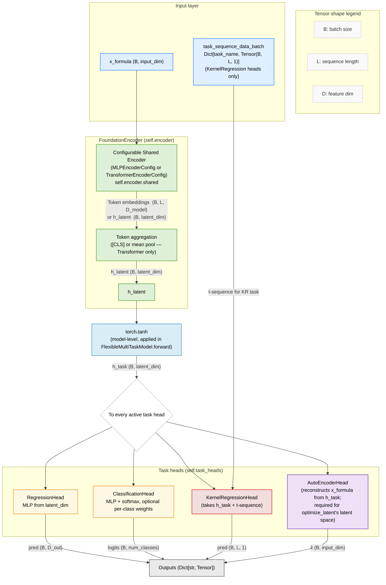
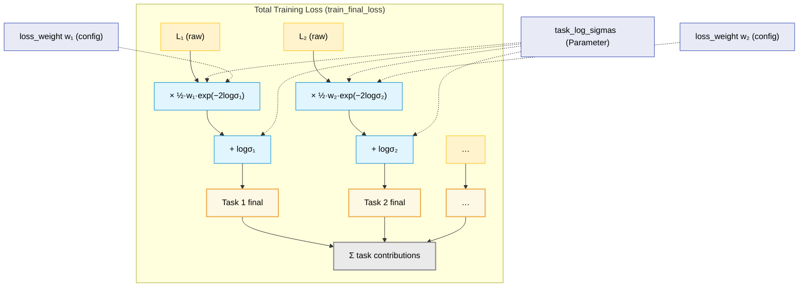
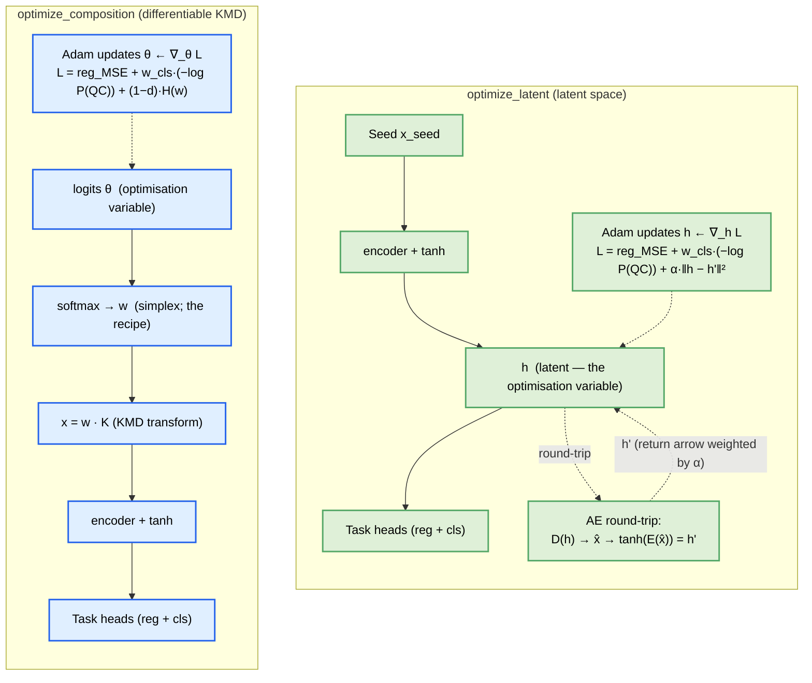

## Project Structure

```
foundation_model/
├── src/foundation_model/        # Main Python package
│   ├── models/                  # Neural network models
│   │   ├── components/          # Reusable encoder + utility blocks
│   │   │   ├── fc_layers.py     # LinearBlock / LinearLayer
│   │   │   └── foundation_encoder.py  # MLP / Transformer backbones
│   │   ├── task_head/           # Task-specific prediction heads
│   │   │   ├── regression.py
│   │   │   ├── classification.py
│   │   │   ├── kernel_regression.py
│   │   │   └── autoencoder.py   # Reconstructs x from h_task; powers optimize_latent
│   │   ├── flexible_multi_task_model.py
│   │   └── model_config.py      # EncoderConfig + per-task config dataclasses
│   ├── data/                    # CompoundDataModule + per-task data sources + splitter
│   ├── utils/                   # KMD + plotting / training helpers
│   └── scripts/                 # Entry points (see below)
│       ├── train.py                       # fm-trainer (LightningCLI)
│       ├── continual_rehearsal_demo.py    # demo runner (training + inverse design)
│       ├── continual_rehearsal_full.py    # formal runner (11- or 24-task + 3 scenarios)
│       ├── continual_rehearsal_common.py  # shared dump / plot helpers
│       ├── finetune_inverse_heads.py      # head-only fine-tune of inverse heads
│       ├── eval_inverse_methods.py        # piecewise latent-vs-composition eval
│       ├── paper_inverse_comparison.py    # single-scenario paper-grade sweep
│       └── paper_inverse_3scenarios.py    # 3-scenario orchestrator
│
├── data/                        # Persistent datasets
├── artifacts/                   # Run outputs (gitignored)
├── samples/                     # TOML / YAML config templates
├── docs/                        # Plan + algorithm reference + summary
├── notebooks/                   # Experiments / analysis
│
├── ARCHITECTURE.md              # This file
├── CHANGES.md                   # Changelog
├── CLAUDE.md / AGENTS.md        # Repo-level coding guidelines
├── README.md                    # Top-level overview + quickstart
├── pyproject.toml               # Dependencies + fm-trainer entry point
└── uv.lock
```

# Model architecture

`FlexibleMultiTaskModel` ([src/foundation_model/models/flexible_multi_task_model.py](src/foundation_model/models/flexible_multi_task_model.py))
is a single-encoder, multi-head supervised model. Composition descriptors enter the encoder,
get `tanh`'d at the model level, and feed every active task head.

## Diagram


```mermaid
graph TD
    subgraph Legend["Tensor-shape legend"]
        direction LR
        B["B: batch size"]
        L["L: sequence length"]
        D["D: feature dim"]
    end

    %% ---------- Inputs ----------
    subgraph InputLayer["Input layer"]
        X_formula["x_formula  (B, input_dim)"]
        Task_Seq_Data["task_sequence_data_batch<br/>Dict[task_name, Tensor(B, L, 1)]<br/>(KernelRegression heads only)"]
    end

    %% ---------- Foundation encoder ----------
    subgraph FoundationEncoderModule["FoundationEncoder (self.encoder)"]
        direction TB
        SharedEncoder["Configurable Shared Encoder<br/>(MLPEncoderConfig or TransformerEncoderConfig)<br/>self.encoder.shared"]
        Aggregation["Token aggregation<br/>([CLS] or mean pool — Transformer only)"]
        X_formula --> SharedEncoder
        SharedEncoder -- "Token embeddings  (B, L, D_model)<br/>or h_latent  (B, latent_dim)" --> Aggregation
        Aggregation -- "h_latent  (B, latent_dim)" --> H_Latent["h_latent"]
    end

    %% ---------- Model-level tanh ----------
    H_Latent --> TANH["torch.tanh<br/>(model-level, applied in FlexibleMultiTaskModel.forward)"]
    TANH -- "h_task  (B, latent_dim)" --> HeadsJunction{"To every active task head"}

    %% ---------- Task heads ----------
    subgraph TaskHeadsModule["Task heads (self.task_heads)"]
        direction TB
        RegHead["RegressionHead<br/>MLP from latent_dim"]
        ClassHead["ClassificationHead<br/>MLP + softmax, optional per-class weights"]
        KRHead["KernelRegressionHead<br/>(takes h_task + t-sequence)"]
        AEHead["AutoEncoderHead<br/>(reconstructs x_formula from h_task;<br/>required for optimize_latent's latent space)"]
    end

    HeadsJunction --> RegHead
    HeadsJunction --> ClassHead
    HeadsJunction --> KRHead
    Task_Seq_Data -- "t-sequence for KR task" --> KRHead
    HeadsJunction --> AEHead

    %% ---------- Outputs ----------
    RegHead -- "pred  (B, D_out)" --> Outputs["Outputs (Dict[str, Tensor])"]
    ClassHead -- "logits  (B, num_classes)" --> Outputs
    KRHead -- "pred  (B, L, 1)" --> Outputs
    AEHead -- "x̂  (B, input_dim)" --> Outputs

    %% ---------- Styles ----------
    classDef input        fill:#E0EFFF,stroke:#5C9DFF,stroke-width:2px,color:#000;
    classDef foundation   fill:#DFF0D8,stroke:#77B55A,stroke-width:2px,color:#000;
    classDef tanh         fill:#D9EDF7,stroke:#6BADCF,stroke-width:2px,color:#000;
    classDef taskhead     fill:#FCF8E3,stroke:#F0AD4E,stroke-width:2px,color:#000;
    classDef kr           fill:#F2DEDE,stroke:#D9534F,stroke-width:2px,color:#000;
    classDef ae           fill:#EFE0F7,stroke:#9067C6,stroke-width:2px,color:#000;
    classDef output       fill:#EAEAEA,stroke:#888888,stroke-width:2px,color:#000;
    classDef junction     fill:#FFFFFF,stroke:#AAAAAA,stroke-width:1px,color:#000,shape:circle;
    classDef legend_style fill:#f9f9f9,stroke:#ccc,stroke-width:1px,color:#333;

    class B,L,D legend_style
    class X_formula,Task_Seq_Data input
    class SharedEncoder,Aggregation,H_Latent foundation
    class TANH tanh
    class HeadsJunction junction
    class RegHead,ClassHead taskhead
    class KRHead kr
    class AEHead ae
    class Outputs output
```

## Component explanations

### 1. Input layer
- **`x_formula`** — composition descriptors, shape `(B, input_dim)`. Typically the output of a
  `descriptor_fn` (see `data/composition_sources.py`) cached per unique composition.
- **`task_sequence_data_batch`** *(KernelRegression heads only)* — `Dict[task_name, Tensor(B,L,1)]`
  carrying the sequence x-axis (e.g. energies for DOS, temperatures for ZT) the KR head consumes.

### 2. Foundation Encoder (`self.encoder`)
A `FoundationEncoder` wrapping either an MLP or a Transformer backbone (mode chosen by
`encoder_config.type`):

- **MLP mode** — `MLPEncoderConfig(hidden_dims=[input_dim, …, latent_dim])` runs a
  `LinearBlock` (Linear + optional BatchNorm1d + LeakyReLU, optional residuals). `hidden_dims[0]`
  is the input dim; `hidden_dims[-1]` is the latent dim.
- **Transformer mode** — `TransformerEncoderConfig(d_model=…, num_layers=…, nhead=…)` treats
  each scalar feature as a token, learns per-token embeddings, runs Transformer encoder blocks,
  and aggregates via either a learnable `[CLS]` token or mean pooling. `latent_dim = d_model`.

The encoder's output is a raw `h_latent` of shape `(B, latent_dim)` — there is **no** deposit
layer. The Tanh activation is applied *at the model level*, see below.

### 3. Model-level Tanh
`FlexibleMultiTaskModel.forward` applies `torch.tanh(self.encoder(x))` once and reuses the
resulting `h_task` for every task head and for `optimize_latent` / `optimize_composition`. This
keeps the head-input distribution bounded and lets the AutoEncoder head learn a stable
reconstruction target for inverse design.

### 4. Task heads (`self.task_heads`)
An `nn.ModuleDict`. All heads consume `h_task` of shape `(B, latent_dim)`.

| Head | Config | Output |
|---|---|---|
| `RegressionHead` | `RegressionTaskConfig(dims=[latent_dim, …, 1])` | `(B, D_out)` |
| `ClassificationHead` | `ClassificationTaskConfig(num_classes=K, class_weights=[…]?)` | logits `(B, K)`; optional per-class loss weights for imbalanced labels (PR #18) |
| `KernelRegressionHead` | `KernelRegressionTaskConfig(x_dim=…, t_dim=…)` | `(B, L, 1)` (one value per t-point) |
| `AutoEncoderHead` | enabled by `FlexibleMultiTaskModel(enable_autoencoder=True)` | `x̂ (B, input_dim)` — reconstruction of the original descriptor; **required for `optimize_latent(optimize_space="latent")`** |

`disabled_task_heads` holds heads taken offline mid-run (e.g. by `model.disable_task(...)` during
the head-only fine-tune in `finetune_inverse_heads`), preserving their weights in the state-dict.

### 5. Model outputs
`forward` returns a `Dict[str, Tensor]` keyed by task name. `predict_step` further unwraps each
head's output via the head's own `predict` method (so e.g. classification gives both `*_logits`
and `*_probabilities`).

## Data flow + dimensionality summary

| Stage | Shape |
|---|---|
| `x_formula` | `(B, input_dim)` |
| After encoder (`h_latent`) | `(B, latent_dim)` |
| After model-level tanh (`h_task`) | `(B, latent_dim)` — feeds every head |
| Regression / Classification / AutoEncoder output | `(B, D_out)` |
| KernelRegression output | `(B, L, 1)` |

## Loss calculation and weighting

### 1. Raw task losses
Each head computes its own loss $\mathcal{L}_t$:

- **Regression** — MSE (often on z-scored targets).
- **Classification** — cross-entropy with optional per-class weights (`class_weights` on the
  task config). When `class_weights=None`, the head registers a buffer of ones so the
  `state_dict` shape is stable across with/without configurations.
- **Kernel regression** — sequence-wise MSE.
- **AutoEncoder** — reconstruction MSE between `h_task` and the round-trip
  `tanh(encoder(decoder(h_task)))`.

### 2. Optional learnable uncertainty (Kendall et al. CVPR 2018)
When `enable_learnable_loss_balancer=True`, the model registers $\log\sigma_t$ per task in
`model.task_log_sigmas` (a `ParameterDict`) and scales each contribution as:

$$ \mathcal{L}'_{t} = \tfrac{1}{2}\,w_t\,\exp(-2\log\sigma_t)\,\mathcal{L}_t + \log\sigma_t $$

with $w_t$ = `loss_weight` from the task config (default 1.0). The $\log\sigma_t$ term
regularises against $\sigma_t \to 0$.

### 3. Total loss
$$ \mathcal{L}_{\text{train}} = \sum_{t} \mathcal{L}'_{t} $$

When the balancer is disabled (default), each term reduces to $w_t \cdot \mathcal{L}_t$.


```mermaid
graph TD
    subgraph OverallLoss["Total Training Loss (train_final_loss)"]
        direction TB
        Sum["Σ task contributions"]:::output
        T1["Task 1 final"]:::taskhead
        T2["Task 2 final"]:::taskhead
        TN["…"]:::taskhead

        T1_raw["L₁ (raw)"]:::rawloss --> Op1["× ½·w₁·exp(−2logσ₁)"]:::operation --> Op1r["+ logσ₁"]:::operation --> T1
        T2_raw["L₂ (raw)"]:::rawloss --> Op2["× ½·w₂·exp(−2logσ₂)"]:::operation --> Op2r["+ logσ₂"]:::operation --> T2
        TN_raw["…"]:::rawloss --> TN

        T1 --> Sum
        T2 --> Sum
        TN --> Sum
    end

    Bal["task_log_sigmas  (Parameter)"]:::inputsrc -.-> Op1
    Bal -.-> Op1r
    Bal -.-> Op2
    Bal -.-> Op2r
    LW1["loss_weight w₁ (config)"]:::inputsrc -.-> Op1
    LW2["loss_weight w₂ (config)"]:::inputsrc -.-> Op2

    classDef output      fill:#EAEAEA,stroke:#888888,stroke-width:2px,color:#000;
    classDef taskhead    fill:#FCF8E3,stroke:#F0AD4E,stroke-width:2px,color:#000;
    classDef rawloss     fill:#FFF3CD,stroke:#FFC107,stroke-width:1px,color:#000;
    classDef operation   fill:#E1F5FE,stroke:#0288D1,stroke-width:1px,color:#000;
    classDef inputsrc    fill:#E8EAF6,stroke:#3F51B5,stroke-width:1px,color:#000;
```

### 4. Validation
The same formulation is reused with the learned $\log\sigma_t$ frozen. `val_final_loss` is the
default monitor for `ModelCheckpoint` / `EarlyStopping`.

## Inverse design (added in PR #18)

The same `FlexibleMultiTaskModel` exposes two gradient-based inverse-design methods on a
trained checkpoint. Both share a regression-MSE + classification-cross-entropy backbone; only
the third loss term and the optimisation variable differ.

| Method | Optimisation variable | Method-specific loss term | Recipe directly available? |
|---|---|---|---|
| `optimize_latent(optimize_space="latent")` | $h$ (latent) | $\alpha \cdot \lVert h - \tanh(E(D(h))) \rVert^2$ — AE-alignment | no — needs AE decode then a `KMD.inverse` |
| `optimize_composition` | $\theta$, with $w = \text{softmax}(\theta)$ | $(1-d)\,H(w)$ — per-output entropy / peakiness | yes — $w$ is the recipe |

User-facing knobs (all on `[0, 1]` where applicable):

- `ae_align_scale` (`optimize_latent`) — AE manifold alignment; sweet spot ≈ 0.5.
- `diversity_scale` (`optimize_composition`) — per-output element diversity; 1.0 = no penalty.
- `seed_blend` — fraction of seed kept at the start, rest is uniform over the whitelist (lets new
  elements enter the recipe).
- `allowed_elements` — hard whitelist over element symbols.
- `element_step_scale` — per-element gradient scaling; `0` hard-locks an element to its seed value.
- `class_target_weight` — weight on the classification objective vs. the regression targets.


```mermaid
graph TD
    subgraph Latent["optimize_latent (latent space)"]
        direction TB
        Seed1["Seed x_seed"]
        Enc1["encoder + tanh"]
        H["h  (latent — the optimisation variable)"]
        AE["AE round-trip:<br/>D(h) → x̂ → tanh(E(x̂)) = h'"]
        Heads1["Task heads (reg + cls)"]
        AdamL["Adam updates h ← ∇_h L<br/>L = reg_MSE + w_cls·(−log P(QC)) + α·‖h − h'‖²"]

        Seed1 --> Enc1 --> H
        H --> Heads1
        H -. round-trip .-> AE
        AE -. "h' (return arrow weighted by α)" .-> H
        AdamL -.-> H
    end

    subgraph Comp["optimize_composition (differentiable KMD)"]
        direction TB
        Theta["logits θ  (optimisation variable)"]
        WSoft["softmax → w  (simplex; the recipe)"]
        KMD["x = w · K  (KMD transform)"]
        Enc2["encoder + tanh"]
        Heads2["Task heads (reg + cls)"]
        AdamC["Adam updates θ ← ∇_θ L<br/>L = reg_MSE + w_cls·(−log P(QC)) + (1−d)·H(w)"]

        Theta --> WSoft --> KMD --> Enc2 --> Heads2
        AdamC -.-> Theta
    end

    classDef latentClass fill:#DFF0D8,stroke:#55A868,stroke-width:2px,color:#000;
    classDef compClass   fill:#E0EFFF,stroke:#2563EB,stroke-width:2px,color:#000;
    class Seed1,Enc1,H,AE,Heads1,AdamL latentClass
    class Theta,WSoft,KMD,Enc2,Heads2,AdamC compClass
```

For the full per-term design intent and the recommended use of each knob, see
[docs/inverse_design_algorithms.md](docs/inverse_design_algorithms.md). For the 3-scenario
study and headline takeaways, see [docs/qc_inverse_design_summary.md](docs/qc_inverse_design_summary.md).
