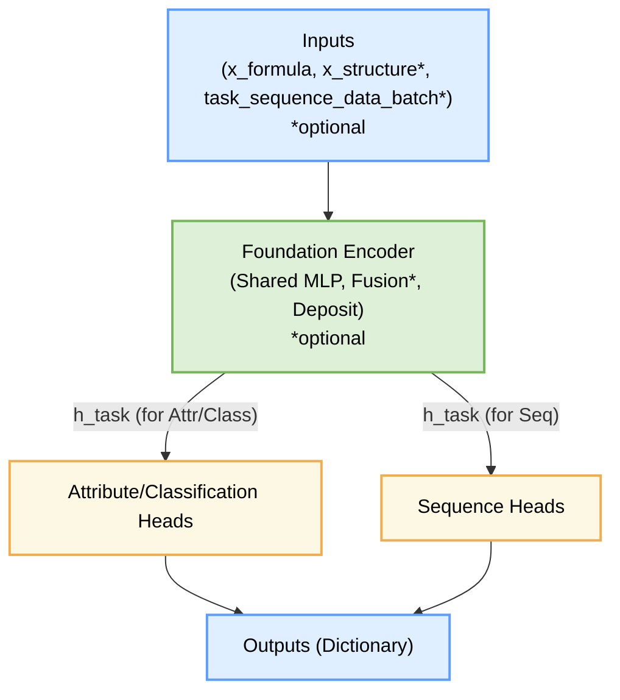

# Foundation Model for Material Properties

A multi-task learning model for predicting various material properties.

## Project Structure

```
foundation_model/
├── src/
│   └── foundation_model/    # Main package
│       ├── models/          # Neural network models
│       │   ├── fc_layers.py # Basic neural network layers
│       │   ├── flexible_multi_task_model.py # Refactored multi-task model
│       │   ├── multi_task_flexible.py # Legacy multi-task property predictor
│       │   ├── task_config.py # Task configuration classes (Pydantic models for task heads)
│       │   ├── model_config.py # Pydantic models for overall model structure (distinct from YAML configs)
│       │   ├── components/   # Model components
│       │   │   ├── foundation_encoder.py # Main encoder combining formula and optional structure
│       │   │   ├── structure_encoder.py # Structure encoding module
│       │   │   ├── lora_adapter.py # Low-Rank Adaptation module
│       │   │   ├── gated_fusion.py # Gated fusion module
│       │   │   └── self_supervised.py # Self-supervised learning components
│       │   └── task_head/    # Task-specific heads
│       │       ├── base.py   # Base task head interfaces
│       │       ├── regression.py # Regression task head
│       │       ├── classification.py # Classification task head
│       │       └── sequence/ # Sequence prediction heads
│       │           ├── base.py # Base sequence head
│       │           ├── rnn.py # RNN-based sequence head
│       │           ├── fixed_vec.py # Fixed vector sequence head
│       │           ├── tcn_film.py # TCN with FiLM modulation
│       │           └── transformer.py # Transformer-based sequence head
│       │
│       ├── data/            # Data handling
│       │   ├── dataset.py   # Dataset implementation
│       │   ├── datamodule.py # Lightning data module
│       │   ├── splitter.py  # Data splitting utilities
│       │   └── preprocessor.py # Data preprocessing tools
│       │
│       ├── utils/           # Utility functions
│       │   ├── training.py  # Training utilities
│       │   └── plotting.py  # Visualization utilities
│       │
│       ├── configs/         # Pydantic configuration models (distinct from YAML configs)
│       │   └── model_config.py # Pydantic models for defining configurations
│       │
│       └── scripts/         # Execution scripts
│           ├── train.py     # Main training script
│           └── update_property_rates.py # Script for updating property rates
│
├── configs/                 # YAML configuration files
│   └── model_configs/       # Model configuration files
│       └── base_model.yaml  # Base model configuration
│
├── data/                    # Data directory
│   └── raw/                 # Raw data files
│
├── results/                 # Output directory
│   ├── models/             # Saved models
│   ├── logs/               # Training logs
│   └── figures/            # Generated plots
│
└── notebooks/              # Jupyter notebooks
    └── experiments/        # Experimental notebooks
```

## Installation

1. Clone the repository:
```bash
git clone https://github.com/yourusername/foundation_model.git
cd foundation_model
```

2. Install the package using uv:
```bash
uv sync --frozen --all-groups
```

This will install all dependencies as defined in the pyproject.toml and uv.lock files, including both production and development dependencies, and ensure exact version matching. This method is preferred for reproducible installations.


If you need to add additional dependencies, use:
```bash
uv add <package_name>
# or for development dependencies
uv add --dev <package_name>
```

After adding new dependencies, update the lock file:
```bash
uv pip freeze > uv.lock
```

## Usage

### Training

To train the model with default settings:

```bash
# From the project root directory
python src/foundation_model/scripts/train.py
```

The training script is installed as part of the package, so you can also run it from anywhere after installation:

```bash
python -m foundation_model.scripts.train
```

### Configuration

There are two ways to configure the model:

1. **Command-line arguments**:

The `src/foundation_model/scripts/train.py` script (which uses `MultiTaskAttributePredictor`) accepts the following arguments to override defaults from `ExperimentConfig` and `ModelConfig`:

- **Attribute Configuration:**
  - `--mp_attrs_rate` (float): Sampling rate for Materials Project attributes (default: 1.0).
- **Training Configuration:**
  - `--max_epochs` (int): Maximum number of training epochs.
  - `--batch_size` (int): Batch size for training.
  - `--num_workers` (int): Number of workers for data loading.
- **Dataset Configuration:**
  - `--train_ratio` (float): Ratio of training data.
  - `--val_ratio` (float): Ratio of validation data.
  - `--test_ratio` (float): Ratio of test data.
  - `--random_seed` (int): Random seed for data splitting.
- **Trainer Configuration (PyTorch Lightning):**
  - `--accelerator` (str): Accelerator type (e.g., "cpu", "gpu").
  - `--devices` (int): Number of devices to use.
  - `--strategy` (str): Training strategy (e.g., "ddp").
- **Experiment Configuration:**
  - `--exp_name` (str): Name of the experiment for logging.
- **Path Configuration:**
  - `--data_dir` (str): Directory containing raw data.
  - `--results_dir` (str): Directory for saving results.
  - `--log_dir` (str): Directory for saving logs (overrides `default_root_dir` for Trainer).
- **Learning Rate Configuration:**
  - `--shared_block_lr` (float): Learning rate for shared blocks.
  - `--task_block_lr` (float): Learning rate for task-specific blocks.

*Note: The `FlexibleMultiTaskModel` and its associated features (like `--pretrain`, `--with_structure`, `--lora_rank`, sequence heads, etc., mentioned in "Quick Examples") are typically configured via YAML files, as shown in `configs/model_configs/base_model.yaml`. The main `train.py` script would need to be adapted or a different script used to run `FlexibleMultiTaskModel` with those specific CLI flags.*

2. **YAML configuration**:

You can also use YAML configuration files for more complex setups. See `configs/model_configs/base_model.yaml` for an example.

#### Pre‑training vs. Fine‑tuning

| Mode | Arguments | What trains |
|------|-----------|-------------|
| **Encoder frozen** | `--freeze_encoder --lora_rank 0` | Only task heads (linear probe) |
| **LoRA micro‑tune** | `--freeze_encoder --lora_rank 8` | Heads + small LoRA adapters |
| **Full fine‑tune** | *(default)* | Encoder + heads |
| **Pre‑train** | `--pretrain --with_structure` | Encoder with dual‑modality losses |

> Tip: combine `--pretrain` with `--loss_weights '{"attr":0,"seq":0}'` if you
> don't want downstream heads to affect pre‑training.


## Update History

Update history has been moved to [changes.md](changes.md).


## Features

- Multi‑task learning for material property prediction  
- **Dual‑modality support**: formula descriptors **+** optional structure descriptors with gated fusion  
- **Pre‑training & downstream in one model**  
  - Pre‑train losses: contrastive, cross‑reconstruction, masked‑feature, property supervision  
  - `--pretrain` flag toggles extra losses; same architecture used for fine‑tune  
- **Flexible sequence heads**: `rnn`, `vec`, `transformer`, `tcn`, `hybrid` (Flash‑Attention inside)  
- **Encoder control**: `--freeze_encoder` to lock shared layers; add *LoRA* adapters with `--lora_rank`  
- Handles missing values via masking & modality dropout  
- Comprehensive logging and visualization tools  
- Configurable data splitting strategies  
- Early stopping and model checkpointing

## Model Architecture

The `FlexibleMultiTaskModel` is designed with a modular and extensible architecture. At its core, it features:

1.  A **Foundation Encoder** that processes input features (formula-based, and optionally structure-based) to generate shared representations. This encoder includes mechanisms for multi-modal fusion if structural data is provided.
2.  An intermediate **Deposit Layer** that acts as a bridge between the shared encoder and task-specific components.
3.  A collection of **Task-specific Heads** that take representations from the foundation encoder (either directly from the latent space or via the deposit layer) to make predictions for various tasks, such as:
    *   Regression (e.g., predicting band gap)
    *   Classification (e.g., predicting material stability)
    *   Sequence Prediction (e.g., predicting density of states curves)

Below is a high-level overview of the architecture:



For a more detailed diagram and in-depth explanation of each component, data flow, and dimensionality, please refer to the [**Model Architecture Documentation (ARCHITECTURE.md)**](ARCHITECTURE.md).

## Data Handling

- Supports multiple material properties
- Handles missing values through masking
- Configurable data splitting ratios
- Property-specific sampling fractions

### Quick Examples

##### Example 1 – Pre‑train with formula+structure

```bash
python -m foundation_model.scripts.train \
  --pretrain --with_structure \
  --loss_weights '{"attr":0,"seq":0}' \
  --max_epochs 60
```

##### Example 2 – Fine‑tune only heads with LoRA (encoder frozen)

```bash
python -m foundation_model.scripts.train \
  --freeze_encoder --lora_rank 8 \
  --sequence_mode rnn
```

##### Example 3 – Full fine‑tune, Flash‑Attention transformer head

```bash
python -m foundation_model.scripts.train \
  --sequence_mode transformer --d_model 256 --nhead 4
```

##### Example 4 – Partial fine‑tune (encoder unlocked, LoRA off)

```bash
python -m foundation_model.scripts.train \
  --freeze_encoder False --lora_rank 0 \
  --sequence_mode vec --seq_len 256
```

### Training with Local Data and YAML Configuration (Scaling Law Demo)

This section demonstrates how to train the `FlexibleMultiTaskModel` using local data files (CSV) and a YAML configuration, highlighting how to explore scaling laws by adjusting data availability for specific tasks using `CompoundDataModule`'s `task_masking_ratios`.

**1. Prepare Dummy Data Files:**

Create the following CSV files in your project, for example, under an `examples/data/` directory:

*   `examples/data/dummy_formula_descriptors.csv`:
    ```csv
    id,comp_feat_1,comp_feat_2
    mat_1,0.1,0.5
    mat_2,0.2,0.6
    mat_3,0.3,0.7
    mat_4,0.4,0.8
    mat_5,0.5,0.9
    mat_6,0.15,0.55
    mat_7,0.25,0.65
    mat_8,0.35,0.75
    mat_9,0.45,0.85
    mat_10,0.55,0.95
    ```

*   `examples/data/dummy_attributes.csv`:
    This file defines the tasks, their target values, and the train/validation/test split.
    ```csv
    id,task_A_regression_value,task_B_sequence_series,task_B_temps,split
    mat_1,1.0,"[0.1,0.2,0.3]","[10,20,30]",train
    mat_2,2.0,"[0.4,0.5,0.6]","[10,20,30]",train
    mat_3,3.0,"[0.7,0.8,0.9]","[10,20,30]",train
    mat_4,1.5,"[0.15,0.25,0.35]","[10,20,30]",train
    mat_5,2.5,"[0.45,0.55,0.65]","[10,20,30]",train
    mat_6,3.5,"[0.75,0.85,0.95]","[10,20,30]",train
    mat_7,4.0,"[0.9,1.0,1.1]","[10,20,30]",val
    mat_8,4.5,"[1.1,1.2,1.3]","[10,20,30]",val
    mat_9,5.0,"[1.2,1.3,1.4]","[10,20,30]",test
    mat_10,5.5,"[1.3,1.4,1.5]","[10,20,30]",test
    ```
    *Note: For sequence tasks, series data and temperature data are represented as strings of lists. `CompoundDataset` will parse these.*

**2. Create YAML Configuration File:**

Create a YAML file, for example, `examples/configs/demo_scaling_law.yaml`:

```yaml
# examples/configs/demo_scaling_law.yaml
experiment_name: "scaling_law_demo"
log_dir: "results/logs_scaling_demo"

# --- Data Module Configuration (for CompoundDataModule) ---
datamodule:
  class_path: foundation_model.data.datamodule.CompoundDataModule
  formula_desc_source: "examples/data/dummy_formula_descriptors.csv" # Path to your formula data
  attributes_source: "examples/data/dummy_attributes.csv"     # Path to your attributes data
  task_configs:
    - name: "task_A" # Corresponds to 'task_A_regression_value' in attributes CSV
      type: "REGRESSION"
      dims: [256, 64, 1] # Example: D_deposit -> hidden -> output
      optimizer: { lr: 0.001, scheduler_type: "None" }
    - name: "task_B" # Corresponds to 'task_B_sequence_series' and 'task_B_temps'
      type: "SEQUENCE"
      subtype: "rnn" 
      d_in: 256 # Should match model's latent_dim output for sequence heads
      hidden: 64
      cell: "gru"
      optimizer: { lr: 0.001, scheduler_type: "None" }
  batch_size: 2
  num_workers: 0
  # train_ratio, val_ratio, test_ratio are ignored if 'split' column is present in attributes_source
  task_masking_ratios:
    task_A: 1.0 # Experiment with this: 1.0, 0.5, 0.25 etc.
    # task_B: 1.0 # Can also apply to other tasks

# --- Model Configuration (for FlexibleMultiTaskModel) ---
model:
  class_path: foundation_model.models.flexible_multi_task_model.FlexibleMultiTaskModel
  shared_block_dims: [2, 128, 256] # Input (2 features from dummy_formula) -> hidden -> latent (D_deposit for attr heads, D_latent for seq heads)
  # task_configs are automatically passed from datamodule by the training script if using LightningCLI or similar
  norm_shared: true
  residual_shared: false
  shared_block_optimizer: { lr: 0.001, scheduler_type: "None" }
  # Ensure other model parameters like with_structure, D_deposit match expectations

# --- Trainer Configuration (PyTorch Lightning) ---
trainer:
  max_epochs: 20 # Adjust as needed for a meaningful demo
  accelerator: "cpu"
  devices: 1
  logger: # Example CSVLogger configuration
    class_path: lightning.pytorch.loggers.CSVLogger
    save_dir: "results/logs_scaling_demo" # Should match experiment_config.log_dir or be derived
    name: ${experiment_name} # Uses experiment_name defined above
  # Add callbacks like ModelCheckpoint if needed
  # default_root_dir: ${log_dir} # Usually set by log_dir
```
*This YAML structure assumes a training script that can instantiate components using `class_path` (e.g., using `jsonargparse` with PyTorch Lightning's `CLI`). The existing `src/foundation_model/scripts/train.py` would need modification or a new script created to support this fully.*

**3. Run Training:**

Assuming you have a training script (e.g., `train_flexible.py`) that uses PyTorch Lightning's `CLI` or a similar mechanism to parse the YAML and CLI arguments:

```bash
python src/foundation_model/scripts/train_flexible.py --config examples/configs/demo_scaling_law.yaml
```
*(If using the existing `train.py`, it would require significant modification to load `FlexibleMultiTaskModel` and `CompoundDataModule` from such a YAML configuration.)*

**4. Demonstrating Scaling Law with `task_masking_ratios`:**

The `task_masking_ratios` parameter in `CompoundDataModule` (set via the YAML) controls the fraction of *valid* (non-NaN) samples used for each specified task during training. A ratio of `1.0` uses all valid samples, `0.5` uses 50%, and so on. This allows you to simulate different dataset sizes for specific tasks.

To observe a scaling law for `task_A`:
1.  **Run 1 (Full Data for task_A):**
    In `demo_scaling_law.yaml`, ensure `task_masking_ratios: { task_A: 1.0 }`. Train the model and note the final validation loss for `task_A`.
2.  **Run 2 (Reduced Data for task_A):**
    Modify `demo_scaling_law.yaml` to `task_masking_ratios: { task_A: 0.5 }` (using 50% of `task_A`'s valid training data). Retrain the model (preferably from scratch or ensure fair comparison) and note the final validation loss for `task_A`.
3.  **Run 3 (Further Reduced Data for task_A):**
    Modify to `task_masking_ratios: { task_A: 0.2 }` (using 20% of `task_A`'s valid training data). Retrain and note the loss.

**Expected Observation:** Generally, as the `task_masking_ratios` for `task_A` decreases (less data used), the final validation loss for `task_A` is expected to be higher, demonstrating the scaling law principle that model performance often improves with more data. Plotting these losses against the data fraction (1.0, 0.5, 0.2) can visualize this relationship.

This setup provides a controlled way to study the impact of data quantity on individual task performance within a multi-task learning framework.
