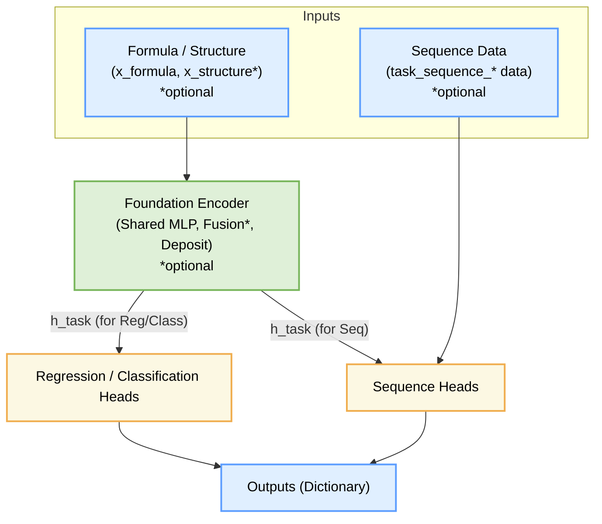
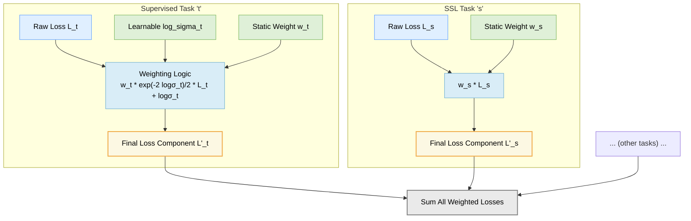

# Foundation Model for Material Properties

A multi-task learning model for predicting various material properties.

## Model Architecture

The `FlexibleMultiTaskModel` is designed with a modular and extensible architecture. At its core, it features:

1.  A **Foundation Encoder** that processes input features (formula-based, and optionally structure-based) to generate shared representations. This encoder includes mechanisms for multi-modal fusion if structural data is provided.
2.  An intermediate **Deposit Layer** that acts as a bridge between the shared encoder and task-specific components.
3.  A collection of **Task-specific Heads** that take representations from the foundation encoder (either directly from the latent space or via the deposit layer) to make predictions for various tasks, such as:
    *   Regression (e.g., predicting band gap)
    *   Classification (e.g., predicting material stability)
    *   Sequence Prediction (e.g., predicting density of states curves)

Below is a high-level overview of the architecture:



For a more detailed diagram and in-depth explanation of each component, data flow, and dimensionality, please refer to the [**Model Architecture Documentation (ARCHITECTURE.md)**](ARCHITECTURE.md).

## Installation

1. Clone the repository:
```bash
git clone https://github.com/yourusername/foundation_model.git
cd foundation_model
```

2. Install the package using uv:
```bash
uv sync --frozen --all-groups
```

This will install all dependencies as defined in the pyproject.toml and uv.lock files, including both production and development dependencies, and ensure exact version matching. This method is preferred for reproducible installations.


If you need to add additional dependencies, use:
```bash
uv add <package_name>
# or for development dependencies
uv add --dev <package_name>
```

## Usage

The primary way to use this model is through the `train.py` script, which leverages PyTorch Lightning's `CLI`. This allows for flexible configuration via YAML files and command-line overrides.

### Training

To train the model, you will typically use a command like:

```bash
# From the project root directory
python -m foundation_model.scripts.train --config path/to/your/config.yaml [OTHER_CLI_OVERRIDES]
```
Or, if you are in `src/foundation_model/scripts/`:
```bash
python train.py --config path/to/your/config.yaml [OTHER_CLI_OVERRIDES]
```

-   Replace `path/to/your/config.yaml` with the path to your experiment's configuration file.
-   `[OTHER_CLI_OVERRIDES]` can be used to override specific parameters within your YAML file (e.g., `--trainer.max_epochs=50`).

### Configuration

Model configuration is primarily handled through YAML files. These files define the model architecture (`FlexibleMultiTaskModel`), data loading (`CompoundDataModule`), PyTorch Lightning trainer settings, and any callbacks.

You can find examples of configuration files in the `samples/generated_configs/` directory (e.g., `generated_model_config.yaml`) and more specific model component configurations in `configs/model_configs/` (e.g., `base_model.yaml`).

For detailed examples of different configurations (such as pre-training, fine-tuning, using specific model components like different sequence heads) and how to effectively use command-line overrides, please refer to the **## Quick Examples** section below.

## Features

- Multi‑task learning for material property prediction  
- **Dual‑modality support**: formula descriptors **+** optional structure descriptors  
- **Pre‑training & downstream in one model**  
  - Pre‑train losses: contrastive, cross‑reconstruction, masked‑feature, property supervision  
  - `--pretrain` flag toggles extra losses; same architecture used for fine‑tune  
- **Flexible sequence heads**: `rnn`, `vec`, `transformer`, `tcn`, `hybrid` (Flash‑Attention inside)  
- **Encoder control**: `--freeze_encoder` to lock shared layers  
- Handles missing values via masking & modality dropout  
- Comprehensive logging and visualization tools  
- Configurable data splitting strategies  
- Early stopping and model checkpointing

### Loss Weighting Strategy

To effectively train the `FlexibleMultiTaskModel` on diverse supervised tasks that may have different loss scales and learning dynamics, a sophisticated loss weighting strategy is employed:

1.  **Supervised Tasks (e.g., Regression, Classification):**
    *   Each supervised task $t$ has its raw loss $\mathcal{L}_t$ (e.g., MSE, Cross-Entropy) calculated by its respective head.
    *   **Learnable Uncertainty:** The model learns a task-specific uncertainty parameter $\sigma_t$ (actually $\log \sigma_t$) for each supervised task. This allows the model to adaptively down-weight tasks that are inherently noisier or harder to learn.
    *   **Static Weights:** An optional static weight $w_t$ (from the `loss_weights` configuration) can also be applied as a manual emphasis.
    *   The final loss component for a supervised task $t$ is calculated as:
        $\mathcal{L}'_{t, \text{final}} = w_t \cdot \frac{\exp(-2 \log \sigma_t)}{2} \mathcal{L}_t + \log \sigma_t$
        This formula balances the raw loss (scaled by precision $1/\sigma_t^2$ and $w_t$) with a regularization term ($\log \sigma_t$) that prevents $\sigma_t$ from collapsing.

2.  **Self-Supervised Learning (SSL) Tasks:**
    *   SSL tasks (e.g., Masked Feature Modeling) are weighted using only their static weights $w_{ssl}$ from the `loss_weights` configuration:
        $\mathcal{L}'_{ssl, \text{final}} = w_{ssl} \cdot \mathcal{L}_{ssl, \text{raw}}$

3.  **Total Loss:**
    *   The total training loss is the sum of all $\mathcal{L}'_{t, \text{final}}$ from supervised tasks and all $\mathcal{L}'_{ssl, \text{final}}$ from SSL tasks.

This adaptive approach, inspired by [Kendall, Gal, and Cipolla (CVPR 2018)](https://doi.org/10.1109/CVPR.2018.00781), helps in robustly training the multi-task model. For a more detailed mathematical derivation and component breakdown, please see the [**Loss Calculation and Weighting section in ARCHITECTURE.md**](ARCHITECTURE.md#loss-calculation-and-weighting).

**Simplified Loss Flow:**



## Data Handling

- Supports multiple material properties
- Handles missing values through masking
- Configurable data splitting ratios
- Property-specific sampling fractions

### Input Data: `attributes_source` Column Naming

When providing data through the `attributes_source` (typically an `attributes.csv` file or a Pandas DataFrame), it is essential to configure your tasks to point to the correct data columns. This is done via the `data_column` field in each task's configuration and, for sequence tasks, the optional `steps_column`.

**1. Primary Data Column (`data_column`):**
   - **Applies to**: `RegressionTaskConfig`, `ClassificationTaskConfig`, `SequenceTaskConfig`.
   - **Field in Config**: `data_column: str`
   - **Purpose**: Specifies the exact name of the column in your `attributes_source` file/DataFrame that contains the primary data for the task.
     - For regression and classification tasks: This column holds the target values.
     - For sequence tasks: This column holds the main sequence data (e.g., the y-values of a spectrum or time series).
   - **Example**:
     ```yaml
     # In your task configuration list:
     # - name: "band_gap_prediction"
     #   type: REGRESSION
     #   data_column: "actual_band_gap_values" # Points to 'actual_band_gap_values' column in attributes.csv
     #   ... other task parameters
     #
     # - name: "xrd_pattern_analysis"
     #   type: SEQUENCE
     #   data_column: "xrd_intensity_series" # Points to 'xrd_intensity_series' column for sequence y-values
     #   steps_column: "xrd_two_theta_angles" # See below
     #   ... other task parameters
     ```

**2. Sequence Steps Column (`steps_column`):**
   - **Applies to**: `SequenceTaskConfig` only.
   - **Field in Config**: `steps_column: str` (optional, defaults to `""`)
   - **Purpose**: Specifies the exact name of the column in your `attributes_source` that contains the steps or x-axis values corresponding to the sequence data (e.g., temperature points, time steps, 2-theta angles).
   - **Behavior**:
     - If specified and the column exists: This data will be loaded and passed to the sequence task head (available in `temps_dict` within `CompoundDataset`).
     - If specified but the column does *not* exist in `attributes_source`: A `ValueError` will be raised during data loading, as this explicitly requested data is missing.
     - If left as an empty string (default): No specific steps column is loaded. `CompoundDataset` will provide a placeholder (e.g., zeros) for the steps data. The sequence model head should be prepared to handle this (e.g., by assuming a default step interval like `torch.arange(sequence_length)`).
   - **Example**:
     ```yaml
     # - name: "temperature_dependent_property"
     #   type: SEQUENCE
     #   data_column: "property_vs_temp_series"
     #   steps_column: "temperature_points" # Points to 'temperature_points' column for x-axis of the sequence
     #   ...
     ```

**Important Considerations:**
*   **Exact Column Names**: The values provided for `data_column` and `steps_column` must exactly match the column headers in your `attributes_source` data file.
*   **Data Format in CSV**: If your `attributes_source` is a CSV file and a column contains list-like data (e.g., for sequence series, multi-dimensional regression targets, or sequence steps), these should be stored as strings that Python's `ast.literal_eval` can parse (e.g., `"[1.0, 2.5, 3.0]"`).
*   **Missing `data_column` Data**: If a `data_column` is specified in a task config but the column is not found in `attributes_source`, or if the column exists but contains many NaNs, the corresponding samples for that task will be masked out (i.e., not used for training or loss calculation for that specific task). Placeholders (e.g., zeros or -1 for classification) will be used for the target values in `y_dict`.
*   **`attributes_source` is `None`**:
    *   If `attributes_source` is not provided to `CompoundDataModule` (typically for prediction scenarios where only input features like `formula_desc_source` are given):
        *   Any task specifying a `data_column` will have its targets treated as placeholders by `CompoundDataset`.
        *   If a `SequenceTaskConfig` specifies a non-empty `steps_column`, `CompoundDataModule` will raise a `ValueError` because `attributes_source` is required to load this essential steps data, even for prediction.

This explicit column mapping approach provides clarity and flexibility in defining how your task configurations link to your data.

## Quick Examples

The `train.py` script utilizes PyTorch Lightning's `CLI` ([see official documentation](https://lightning.ai/docs/pytorch/stable/cli/lightning_cli.html)). This allows for comprehensive configuration of the model (`FlexibleMultiTaskModel`) and data module (`CompoundDataModule`) through YAML files, with parameters passed directly to their `__init__` methods via an `init_args` block. You can also override these YAML settings using command-line arguments.

It's recommended to start with a base YAML configuration (e.g., `samples/generated_configs/generated_model_config.yaml` or `configs/model_configs/base_model.yaml` adapted to the `init_args` structure) and then customize it.

**Command-Line Overrides:**
To override a parameter, you specify its full path. For example:
*   `--model.init_args.shared_block_optimizer.freeze_parameters=True`
*   `--trainer.max_epochs=50`

**Note:** Low-Rank Adaptation (LoRA) support has been removed from the codebase. Any legacy configuration keys such as `lora_rank` or `lora_enabled` are currently ignored by the model.

##### Example 1 – Supervised training run

This example runs standard supervised training. Adjust `loss_weights` if you need to emphasise
specific tasks.

```bash
python -m foundation_model.scripts.train --config path/to/your/config.yaml \
  --trainer.max_epochs 60
```
*Corresponding YAML snippet (`config.yaml`):*
```yaml
model:
  class_path: foundation_model.models.FlexibleMultiTaskModel
  init_args:
    # ... other shared_block_dims, task_configs ...
    # loss_weights:
    #   example_task_1: 1.0
trainer:
  max_epochs: 60
```

##### Example 2 – Fine-tune only heads (encoder frozen)

This example demonstrates fine-tuning where the main encoder is frozen. This is achieved by setting `freeze_parameters: true` in the `shared_block_optimizer` configuration. A sequence task (e.g., 'temp_curve') uses an RNN head.

```bash
# Assumes config.yaml is set for fine-tuning and includes a sequence task configured with subtype "rnn".

python -m foundation_model.scripts.train --config path/to/your/config.yaml \
  --model.init_args.shared_block_optimizer.freeze_parameters=True
```
*YAML snippet (`config.yaml`):*
```yaml
# In your config.yaml
# ...
model:
  class_path: foundation_model.models.FlexibleMultiTaskModel
  init_args:
    # ...
    shared_block_optimizer:
      # ...
      freeze_parameters: true # This freezes the shared encoder
    task_configs:
      - name: "temp_curve" # Example sequence task
        type: "SEQUENCE"
        subtype: "rnn"
        # ... other settings for temp_curve ...
      # ... other tasks ...
# ...
```

##### Example 3 – Full fine-tune, Transformer sequence head

Full fine-tune: encoder is not frozen (`freeze_parameters: false`). A sequence task uses a Transformer head, configured in YAML.

```bash
# Assumes config.yaml is set for fine-tuning.
# The relevant sequence task should be configured with subtype "transformer" in YAML.

python -m foundation_model.scripts.train --config path/to/your/transformer_config.yaml \
  --model.init_args.shared_block_optimizer.freeze_parameters=False
```
*YAML snippet (`transformer_config.yaml`):*
```yaml
# In transformer_config.yaml
# ...
model:
  class_path: foundation_model.models.FlexibleMultiTaskModel
  init_args:
    # ...
    shared_block_optimizer:
      # ...
      freeze_parameters: false # Encoder is trainable
    task_configs:
      - name: "temp_dos_transformer" # Example sequence task
        type: "SEQUENCE"
        subtype: "transformer" # Key: Use Transformer head
        d_in: 512             # Input dimension from encoder deposit layer
        d_model: 256          # Transformer d_model
        nhead: 4              # Transformer nhead
        # ... other transformer parameters (num_encoder_layers, dim_feedforward, etc.)
        # ... other settings for this task ...
      # ... other tasks ...
# ...
```

##### Example 4 – Partial fine-tune (encoder unlocked, specific sequence head)

Similar to full fine-tune (encoder trainable). A sequence task uses a 'vector' head, configured in YAML.

```bash
# Assumes config.yaml is set for fine-tuning.
# The relevant sequence task should be configured with subtype "vec" in YAML.

python -m foundation_model.scripts.train --config path/to/your/vec_head_config.yaml \
  --model.init_args.shared_block_optimizer.freeze_parameters=False
```
*YAML snippet (`vec_head_config.yaml`):*
```yaml
# In vec_head_config.yaml
# ...
model:
  class_path: foundation_model.models.FlexibleMultiTaskModel
  init_args:
    # ...
    shared_block_optimizer:
      # ...
      freeze_parameters: false # Encoder is trainable
    task_configs:
      - name: "temp_dos_vector" # Example sequence task
        type: "SEQUENCE"
        subtype: "vec"       # Key: Use fixed vector output head
        d_in: 512            # Input dimension from encoder deposit layer
        seq_len: 256         # Desired output sequence length for the vector
        # ... other vec head parameters ...
      # ... other settings for this task ...
# ...
```
These examples should provide a more accurate reflection of how to use `train.py` with your `LightningCLI` setup.

### Training with Local Data and YAML Configuration (Scaling Law Demo)

This section demonstrates how to train the `FlexibleMultiTaskModel` using local data files (CSV) and a YAML configuration, highlighting how to explore scaling laws by adjusting data availability for specific tasks using `CompoundDataModule`'s `task_masking_ratios`.

**1. Prepare Dummy Data Files:**

Create the following CSV files in your project, for example, under an `examples/data/` directory:

*   `examples/data/dummy_formula_descriptors.csv`:
    ```csv
    id,comp_feat_1,comp_feat_2
    mat_1,0.1,0.5
    mat_2,0.2,0.6
    mat_3,0.3,0.7
    mat_4,0.4,0.8
    mat_5,0.5,0.9
    mat_6,0.15,0.55
    mat_7,0.25,0.65
    mat_8,0.35,0.75
    mat_9,0.45,0.85
    mat_10,0.55,0.95
    ```

*   `examples/data/dummy_attributes.csv`:
    This file defines the tasks, their target values, and the train/validation/test split. Column names are generic; the mapping to tasks is done in the YAML configuration.
    ```csv
    id,target_A,series_B_y,series_B_x,split
    mat_1,1.0,"[0.1,0.2,0.3]","[10,20,30]",train
    mat_2,2.0,"[0.4,0.5,0.6]","[10,20,30]",train
    mat_3,3.0,"[0.7,0.8,0.9]","[10,20,30]",train
    mat_4,1.5,"[0.15,0.25,0.35]","[10,20,30]",train
    mat_5,2.5,"[0.45,0.55,0.65]","[10,20,30]",train
    mat_6,3.5,"[0.75,0.85,0.95]","[10,20,30]",train
    mat_7,4.0,"[0.9,1.0,1.1]","[10,20,30]",val
    mat_8,4.5,"[1.1,1.2,1.3]","[10,20,30]",val
    mat_9,5.0,"[1.2,1.3,1.4]","[10,20,30]",test
    mat_10,5.5,"[1.3,1.4,1.5]","[10,20,30]",test
    ```
    *Note: For sequence tasks, series data and x-axis (steps) data are represented as strings of lists. `CompoundDataset` will parse these.*

**2. Create YAML Configuration File:**

Create a YAML file, for example, `examples/configs/demo_scaling_law.yaml`. This example uses the `init_args` structure expected by `LightningCLI`.

```yaml
# examples/configs/demo_scaling_law.yaml
experiment_name: "scaling_law_demo" # Can be overridden by CLI
seed_everything: 42 # For reproducibility

# --- Model Configuration (for FlexibleMultiTaskModel) ---
model:
  class_path: foundation_model.models.FlexibleMultiTaskModel
  init_args:
    shared_block_dims: [2, 128, 256] # Input (dummy_formula_descriptors.csv has 2 features) -> hidden -> latent
    task_configs:
      - name: "task_A"
        type: "REGRESSION"
        data_column: "target_A" # Maps to 'target_A' column in dummy_attributes.csv
        dims: [256, 64, 1]      # latent_dim_from_deposit -> hidden -> output
        optimizer: { lr: 0.001, scheduler_type: "None" }
      - name: "task_B"
        type: "SEQUENCE"
        subtype: "rnn"
        data_column: "series_B_y"  # Maps to 'series_B_y' for y-values
        steps_column: "series_B_x" # Maps to 'series_B_x' for x-values (steps)
        d_in: 256                  # Should match the model's deposit_dim for sequence heads
        hidden: 64
        cell: "gru"
        optimizer: { lr: 0.001, scheduler_type: "None" }
    # Add other model.init_args as needed, e.g.:
    # norm_shared: true
    # residual_shared: false
    shared_block_optimizer: { lr: 0.001, scheduler_type: "None", freeze_parameters: false }

# --- Data Module Configuration (for CompoundDataModule) ---
data: # Renamed from datamodule for consistency with LightningCLI v2.0+ common practice
  class_path: foundation_model.data.CompoundDataModule
  init_args:
    formula_desc_source: "examples/data/dummy_formula_descriptors.csv"
    attributes_source: "examples/data/dummy_attributes.csv"
    task_configs: ${model.init_args.task_configs} # Dynamically uses task_configs from model
    batch_size: 2
    num_workers: 0
    # train_ratio, val_ratio, test_split are used if 'split' column is NOT in attributes_source
    # val_split: 0.1 
    # test_split: 0.1
    # train_random_seed: 42
    task_masking_ratios:
      task_A: 1.0 # Experiment with this: 1.0, 0.5, 0.25 etc. for task_A
      # task_B: 1.0 # Can also apply to other tasks

# --- Trainer Configuration (PyTorch Lightning) ---
trainer:
  default_root_dir: "results/logs/${experiment_name}" # Organizes logs by experiment name
  max_epochs: 20 # Adjust as needed for a meaningful demo
  accelerator: "cpu"
  devices: 1
  logger:
    - class_path: lightning.pytorch.loggers.CSVLogger
      init_args:
        save_dir: "${trainer.default_root_dir}"
        name: "" # Logs will be in ${trainer.default_root_dir}/version_X
    - class_path: lightning.pytorch.loggers.TensorBoardLogger
      init_args:
        save_dir: "${trainer.default_root_dir}"
        name: ""
  # callbacks:
  #   - class_path: lightning.pytorch.callbacks.ModelCheckpoint
  #     init_args:
  #       monitor: "val_total_loss" # Or a specific task's validation loss
  #       mode: "min"
  #   - class_path: lightning.pytorch.callbacks.EarlyStopping
  #     init_args:
  #       monitor: "val_total_loss"
  #       patience: 5
  #       mode: "min"
```
*The `train.py` script, using `LightningCLI`, will parse this YAML. Ensure `train.py` is set up to correctly pass `init_args` to the respective classes.*

**3. Run Training:**

Assuming you have a training script (e.g., `train_flexible.py`) that uses PyTorch Lightning's `CLI` or a similar mechanism to parse the YAML and CLI arguments:

```bash
python src/foundation_model/scripts/train_flexible.py --config examples/configs/demo_scaling_law.yaml
```
*(If using the existing `train.py`, it would require significant modification to load `FlexibleMultiTaskModel` and `CompoundDataModule` from such a YAML configuration.)*

**4. Demonstrating Scaling Law with `task_masking_ratios`:**

The `task_masking_ratios` parameter in `CompoundDataModule` (set via the YAML) controls the fraction of *valid* (non-NaN) samples used for each specified task during training. A ratio of `1.0` uses all valid samples, `0.5` uses 50%, and so on. This allows you to simulate different dataset sizes for specific tasks.

To observe a scaling law for `task_A`:
1.  **Run 1 (Full Data for task_A):**
    In `demo_scaling_law.yaml`, ensure `task_masking_ratios: { task_A: 1.0 }`. Train the model and note the final validation loss for `task_A`.
2.  **Run 2 (Reduced Data for task_A):**
    Modify `demo_scaling_law.yaml` to `task_masking_ratios: { task_A: 0.5 }` (using 50% of `task_A`'s valid training data). Retrain the model (preferably from scratch or ensure fair comparison) and note the final validation loss for `task_A`.
3.  **Run 3 (Further Reduced Data for task_A):**
    Modify to `task_masking_ratios: { task_A: 0.2 }` (using 20% of `task_A`'s valid training data). Retrain and note the loss.

**Expected Observation:** Generally, as the `task_masking_ratios` for `task_A` decreases (less data used), the final validation loss for `task_A` is expected to be higher, demonstrating the scaling law principle that model performance often improves with more data. Plotting these losses against the data fraction (1.0, 0.5, 0.2) can visualize this relationship.

This setup provides a controlled way to study the impact of data quantity on individual task performance within a multi-task learning framework.

## Update History

Update history has been moved to [CHANGES.md](CHANGES.md).
