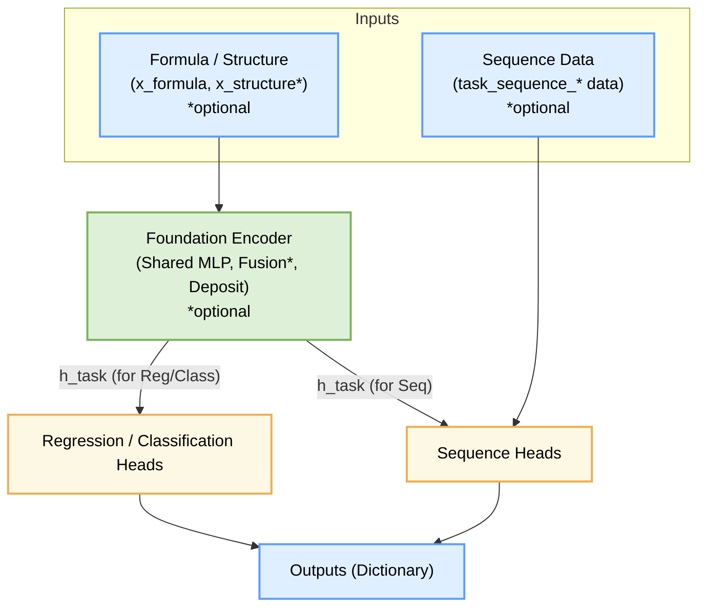

# Foundation Model for Material Properties

A multi-task learning model for predicting various material properties.

## Model Architecture

The `FlexibleMultiTaskModel` is designed with a modular and extensible architecture. At its core, it features:

1.  A **Foundation Encoder** that processes input features (formula-based, and optionally structure-based) to generate shared representations. This encoder includes mechanisms for multi-modal fusion if structural data is provided.
2.  A **Tanh Activation** that is uniformly applied to latent representations at the model level, providing bounded outputs to task heads.
3.  A collection of **Task-specific Heads** that take Tanh-activated latent representations from the foundation encoder to make predictions for various tasks, such as:
    *   Regression (e.g., predicting band gap)
    *   Classification (e.g., predicting material stability)
    *   Sequence Prediction (e.g., predicting density of states curves)

Below is a high-level overview of the architecture:


```mermaid
graph TD
    %% ---------- Inputs (同一级) ----------
    subgraph InputsLayer["Inputs"]
        direction TB
        GeneralInputs["Formula / Structure<br/>(x_formula, x_structure*)<br/>*optional"]
        SequenceDataInputs["Sequence Data<br/>(task_sequence_* data)<br/>*optional"]
    end

    %% ---------- Foundation encoder ----------
    FE["Foundation Encoder<br/>(Shared MLP, Fusion*, Deposit)<br/>*optional"]

    %% ---------- Task heads ----------
    NonSeqHeads["Regression / Classification Heads"]
    SeqHeads["Sequence Heads"]

    %% ---------- Edges ----------
    GeneralInputs --> FE
    FE -- "h_task (for Reg/Class)" --> NonSeqHeads
    FE -- "h_task (for Seq)" --> SeqHeads
    SequenceDataInputs --> SeqHeads
    NonSeqHeads --> Outputs["Outputs (Dictionary)"]
    SeqHeads --> Outputs

    %% ---------- Styles ----------
    classDef io    fill:#E0EFFF,stroke:#5C9DFF,stroke-width:2px,color:#000;
    classDef main  fill:#DFF0D8,stroke:#77B55A,stroke-width:2px,color:#000;
    classDef heads fill:#FCF8E3,stroke:#F0AD4E,stroke-width:2px,color:#000;

    %% ---------- Class assignments ----------
    class GeneralInputs,SequenceDataInputs io
    class FE main
    class NonSeqHeads,SeqHeads heads
    class Outputs io
```

For a more detailed diagram and in-depth explanation of each component, data flow, and dimensionality, please refer to the [**Model Architecture Documentation (ARCHITECTURE.md)**](ARCHITECTURE.md).

## Installation

1. Clone the repository:
```bash
git clone https://github.com/yourusername/foundation_model.git
cd foundation_model
```

2. Install the package using uv:
```bash
uv sync --frozen --all-groups
```

This will install all dependencies as defined in the pyproject.toml and uv.lock files, including both production and development dependencies, and ensure exact version matching. This method is preferred for reproducible installations.


If you need to add additional dependencies, use:
```bash
uv add <package_name>
# or for development dependencies
uv add --dev <package_name>
```

## Usage

The primary way to use this model is through the `train.py` script, which leverages PyTorch Lightning's `CLI`. This allows for flexible configuration via YAML files and command-line overrides.

### Training

To train the model, you will typically use a command like:

```bash
# From the project root directory
python -m foundation_model.scripts.train --config path/to/your/config.yaml [OTHER_CLI_OVERRIDES]
```
Or, if you are in `src/foundation_model/scripts/`:
```bash
python train.py --config path/to/your/config.yaml [OTHER_CLI_OVERRIDES]
```

-   Replace `path/to/your/config.yaml` with the path to your experiment's configuration file.
-   `[OTHER_CLI_OVERRIDES]` can be used to override specific parameters within your YAML file (e.g., `--trainer.max_epochs=50`).

### Configuration

Model configuration is primarily handled through YAML files. These files define the model architecture (`FlexibleMultiTaskModel`), data loading (`CompoundDataModule`), PyTorch Lightning trainer settings, and any callbacks.

You can find examples of configuration files in the `samples/generated_configs/` directory (e.g., `generated_model_config.yaml`) and more specific model component configurations in `configs/model_configs/` (e.g., `base_model.yaml`).

For detailed examples of different configurations (such as pre-training, fine-tuning, using specific model components like different sequence heads) and how to effectively use command-line overrides, please refer to the **## Quick Examples** section below.

## Features

- Multi‑task learning for material property prediction  
- **Dual‑modality support**: formula descriptors **+** optional structure descriptors  
- **Pre‑training & downstream in one model**  
  - Pre‑train losses: contrastive, cross‑reconstruction, masked‑feature, property supervision  
  - `--pretrain` flag toggles extra losses; same architecture used for fine‑tune  
- **Flexible sequence heads**: `rnn`, `vec`, `transformer`, `tcn`, `hybrid` (Flash‑Attention inside)  
- **Encoder control**: `--freeze_encoder` to lock shared layers  
- Handles missing values via masking & modality dropout  
- Comprehensive logging and visualization tools  
- Configurable data splitting strategies  
- Early stopping and model checkpointing

### Loss Weighting Strategy

To train the `FlexibleMultiTaskModel` on supervised tasks with different loss scales, we rely on a learnable uncertainty term inspired by [Kendall, Gal, and Cipolla (CVPR 2018)](https://doi.org/10.1109/CVPR.2018.00781):

1.  **Task heads produce raw losses.** Each supervised task $t$ supplies the head-specific loss $\mathcal{L}_t$ (e.g., MSE or cross-entropy).
2.  **Per-task static scaling.** Each task configuration exposes `loss_weight` (default `1.0`) to scale that task’s raw loss before further combination.
3.  **Optional learnable uncertainty.** When `enable_learnable_loss_balancer` is `True`, the model maintains a per-task parameter $\log \sigma_t` and scales the contribution as $\mathcal{L}'_{t} = \tfrac{1}{2}\,\texttt{loss\_weight}_t\,\exp(-2 \log \sigma_t)\,\mathcal{L}_t + \log \sigma_t`. This lets the model down-weight noisier objectives while respecting explicit task priorities.
4.  **Fallback when disabled.** If the balancer is disabled or a task does not expose $\log \sigma_t`, the contribution becomes $\mathcal{L}'_{t} = \texttt{loss\_weight}_t \cdot \mathcal{L}_t`.
5.  **Total loss.** The overall objective is the sum of all task contributions.

See [ARCHITECTURE.md](ARCHITECTURE.md#loss-calculation-and-weighting) for a deeper walk-through of the loss pipeline and implementation hooks.

## Data Handling

- Supports multiple material properties
- Handles missing values through masking
- Configurable data splitting ratios
- Property-specific sampling fractions

### Input Data: composition-keyed per-task sources

`CompoundDataModule` is **composition-keyed**: each task owns its own data file(s), joined to
the others by a shared **composition** column. There is no monolithic attributes file — adding
a new property task means adding one file plus one task config. Descriptors are computed on
demand from the union of compositions via a user-supplied `descriptor_fn` (results are cached
per unique composition).

**DataModule wiring:**

```yaml
data:
  class_path: foundation_model.data.datamodule.CompoundDataModule
  init_args:
    # Computes descriptors from compositions. PrecomputedDescriptorSource looks them up from a
    # composition-indexed file; supply your own callable to compute them instead.
    descriptor_fn:
      class_path: foundation_model.data.composition_sources.PrecomputedDescriptorSource
      init_args:
        path: "data/descriptors.parquet"
        composition_column: null   # null => use the file's index as the composition key
    composition_column: "composition"   # the join key shared across all task files
    # default_data_files: "data/all_targets.parquet"  # optional shared fallback for tasks
    #                                                  # that don't declare their own data_files
    val_split: 0.1
    test_split: 0.1
    random_seed: 42
    batch_size: 64
```

**Per-task data** is configured on each task config (`BaseTaskConfig`):

| Field | Purpose |
|-------|---------|
| `data_files` | This task's own source file(s) (`csv` / `parquet` / `pd.xz` / `pkl`), concatenated by rows |
| `data_column` | Column inside that file holding the target values |
| `t_column` | (Kernel regression) column holding the sequence x-axis (energy / temperature / time) |
| `composition_column` | Per-task override of the global composition column |
| `split_column` | Optional in-file `train` / `val` / `test` labels (default `"split"`) |
| `task_masking_ratio` | Optional keep-ratio applied to this task's valid training samples |
| `predict_idx` | Composition subset to predict: a literal `train`/`val`/`test`/`all` or an explicit list |

```yaml
# In model.init_args.task_configs (linked into the datamodule automatically):
- name: band_gap
  type: REGRESSION
  data_files: "data/band_gap.parquet"
  data_column: "Band gap"
  # split_column: "split"        # optional
  # task_masking_ratio: 0.9      # optional
  # predict_idx: "test"          # optional
- name: dos
  type: KernelRegression
  data_files: "data/dos.parquet"
  data_column: "DOS density"
  t_column: "DOS energy"
```

**Splitting.** A single composition-level train/val/test split is derived by overlaying every
task file's `split` column (precedence `test > val > train`; conflicts warn). Compositions
without a label fall back to a representative random split (`MultiTaskSplitter`) that keeps each
task represented across all three sets. `test_all=True` assigns everything to test.

**Prediction.** Each task's `predict_idx` selects a composition subset; the predict set is their
union, exposed as `datamodule.predict_compositions` and attached as the output index by
`PredictionDataFrameWriter` (single-process runs).

**Important considerations:**
*   **Exact column names**: `data_column` / `t_column` / `composition_column` must match the
    source columns exactly. The composition key may be a column or the file's index name.
*   **List-valued cells**: sequences / multi-dim targets stored in CSV must be strings parseable
    by `ast.literal_eval`, e.g. `"[1.0, 2.5, 3.0]"`.
*   **Missing data**: compositions absent from a task's file (or with NaN targets) are **masked
    out** for that task rather than dropped; placeholders fill `y_dict`.
*   **Missing descriptors**: compositions for which `descriptor_fn` produces no valid descriptor
    are dropped from all splits (with a warning).

## Quick Examples

The `train.py` script utilizes PyTorch Lightning's `CLI` ([see official documentation](https://lightning.ai/docs/pytorch/stable/cli/lightning_cli.html)). This allows for comprehensive configuration of the model (`FlexibleMultiTaskModel`) and data module (`CompoundDataModule`) through YAML files, with parameters passed directly to their `__init__` methods via an `init_args` block. You can also override these YAML settings using command-line arguments.

You can also adjust tasks programmatically. For example, to swap in two new heads after loading a checkpoint:

```python
model.remove_tasks("old_regression")
model.add_task(new_reg_cfg, new_cls_cfg)  # accepts multiple configs in one call
```

It's recommended to start with a base YAML configuration (e.g., `samples/generated_configs/generated_model_config.yaml` or `configs/model_configs/base_model.yaml` adapted to the `init_args` structure) and then customize it.

**Command-Line Overrides:**
To override a parameter, you specify its full path. For example:
*   `--model.init_args.shared_block_optimizer.freeze_parameters=True`
*   `--trainer.max_epochs=50`

**Note:** Low-Rank Adaptation (LoRA) support has been removed from the codebase. Any legacy configuration keys such as `lora_rank` or `lora_enabled` are currently ignored by the model.

##### Example 1 – Supervised training run

This example runs standard supervised training.

```bash
python -m foundation_model.scripts.train --config path/to/your/config.yaml \
  --trainer.max_epochs 60
```
*Corresponding YAML snippet (`config.yaml`):*
```yaml
model:
  class_path: foundation_model.models.FlexibleMultiTaskModel
  init_args:
    # ... other shared_block_dims ...
    task_configs:
      - name: example_task_1
        type: REGRESSION
        dims: [128, 64, 1]
        data_column: my_property
        loss_weight: 0.8  # Optional per-task scaling (defaults to 1.0)
      # - name: another_task
      #   ...
      #   loss_weight: 1.0
trainer:
  max_epochs: 60
```

##### Example 2 – Fine-tune only heads (encoder frozen)

This example demonstrates fine-tuning where the main encoder is frozen. This is achieved by setting `freeze_parameters: true` in the `shared_block_optimizer` configuration. A sequence task (e.g., 'temp_curve') uses an RNN head.

```bash
# Assumes config.yaml is set for fine-tuning and includes a sequence task configured with subtype "rnn".

python -m foundation_model.scripts.train --config path/to/your/config.yaml \
  --model.init_args.shared_block_optimizer.freeze_parameters=True
```
*YAML snippet (`config.yaml`):*
```yaml
# In your config.yaml
# ...
model:
  class_path: foundation_model.models.FlexibleMultiTaskModel
  init_args:
    # ...
    shared_block_optimizer:
      # ...
      freeze_parameters: true # This freezes the shared encoder
    task_configs:
      - name: "temp_curve" # Example sequence task
        type: "SEQUENCE"
        subtype: "rnn"
        # ... other settings for temp_curve ...
      # ... other tasks ...
# ...
```

##### Example 3 – Full fine-tune, Transformer sequence head

Full fine-tune: encoder is not frozen (`freeze_parameters: false`). A sequence task uses a Transformer head, configured in YAML.

```bash
# Assumes config.yaml is set for fine-tuning.
# The relevant sequence task should be configured with subtype "transformer" in YAML.

python -m foundation_model.scripts.train --config path/to/your/transformer_encoder.yaml \
  --model.init_args.shared_block_optimizer.freeze_parameters=False
```
*YAML snippet (`transformer_encoder.yaml`):*
```yaml
# In transformer_encoder.yaml
# ...
model:
  class_path: foundation_model.models.FlexibleMultiTaskModel
  init_args:
    # ...
    shared_block_dims: [128, 256]  # Input dimension -> fallback latent dimension
    encoder_config:
      type: transformer
      d_model: 256
      num_layers: 4
      nhead: 4
      dropout: 0.1
      use_cls_token: true
      apply_layer_norm: true
    shared_block_optimizer:
      # ...
      freeze_parameters: false # Encoder is trainable
    task_configs:
      - name: "temp_dos_transformer" # Example sequence task
        type: "SEQUENCE"
        subtype: "transformer" # Key: Use Transformer head
        d_in: 256             # Input dimension (Tanh-activated latent from encoder)
        d_model: 256          # Transformer d_model for the head
        nhead: 4              # Transformer nhead
        # ... other transformer parameters (num_encoder_layers, dim_feedforward, etc.)
        # ... other settings for this task ...
      # ... other tasks ...
# ...
```

> ℹ️ **How the Transformer encoder trains tokens**
>
> * With ``use_cls_token: true`` the task heads consume the contextualised
>   ``[CLS]`` embedding. Even though the other feature tokens are not pooled
>   explicitly, they still receive gradients through the attention connections to
>   the classifier query because their keys and values inform every ``[CLS]``
>   update.
> * Setting ``use_cls_token: false`` switches to mean pooling so every token is
>   exposed directly to the supervised loss without relying on masked pre-training;
>   gradients are distributed evenly across the sequence length.
> * Both aggregation modes therefore keep all feature tokens in play for
>   supervised objectives, and you can choose the variant that best matches your
>   task assumptions.

##### Example 4 – Partial fine-tune (encoder unlocked, specific sequence head)

Similar to full fine-tune (encoder trainable). A sequence task uses a 'vector' head, configured in YAML.

```bash
# Assumes config.yaml is set for fine-tuning.
# The relevant sequence task should be configured with subtype "vec" in YAML.

python -m foundation_model.scripts.train --config path/to/your/vec_head_config.yaml \
  --model.init_args.shared_block_optimizer.freeze_parameters=False
```
*YAML snippet (`vec_head_config.yaml`):*
```yaml
# In vec_head_config.yaml
# ...
model:
  class_path: foundation_model.models.FlexibleMultiTaskModel
  init_args:
    # ...
    shared_block_optimizer:
      # ...
      freeze_parameters: false # Encoder is trainable
    task_configs:
      - name: "temp_dos_vector" # Example sequence task
        type: "SEQUENCE"
        subtype: "vec"       # Key: Use fixed vector output head
        d_in: 512            # Input dimension (Tanh-activated latent from encoder)
        seq_len: 256         # Desired output sequence length for the vector
        # ... other vec head parameters ...
      # ... other settings for this task ...
# ...
```
These examples should provide a more accurate reflection of how to use `train.py` with your `LightningCLI` setup.

### Training with Local Data and YAML Configuration (Scaling Law Demo)

This section demonstrates training `FlexibleMultiTaskModel` from local files with a YAML
config, and how to explore scaling laws by varying a task's data via its per-task
`task_masking_ratio`. Each task owns its own file, joined to the descriptors by a
**composition** column.

**1. Prepare local data files:**

*   `examples/data/descriptors.csv` — composition-indexed descriptor features:
    ```csv
    composition,comp_feat_1,comp_feat_2
    mat_1,0.1,0.5
    mat_2,0.2,0.6
    mat_3,0.3,0.7
    mat_4,0.4,0.8
    mat_5,0.5,0.9
    mat_6,0.15,0.55
    mat_7,0.25,0.65
    mat_8,0.35,0.75
    mat_9,0.45,0.85
    mat_10,0.55,0.95
    ```

*   `examples/data/task_A.csv` — a regression task's own file (composition + target + split):
    ```csv
    composition,target_A,split
    mat_1,1.0,train
    mat_2,2.0,train
    mat_3,3.0,train
    mat_4,1.5,train
    mat_5,2.5,train
    mat_6,3.5,train
    mat_7,4.0,val
    mat_8,4.5,val
    mat_9,5.0,test
    mat_10,5.5,test
    ```

*   `examples/data/task_dos.csv` — a kernel-regression task with sequence target + x-axis.
    List-valued cells are strings parseable by `ast.literal_eval`:
    ```csv
    composition,dos_y,dos_x,split
    mat_1,"[0.1,0.2,0.3]","[10,20,30]",train
    mat_2,"[0.4,0.5,0.6]","[10,20,30]",train
    mat_9,"[1.2,1.3,1.4]","[10,20,30]",test
    mat_10,"[1.3,1.4,1.5]","[10,20,30]",test
    ```
    Compositions absent from a task's file (e.g. `mat_3` for `task_dos`) are simply masked
    out for that task — no need to align files by hand.

**2. Create the YAML configuration (`examples/configs/demo_scaling_law.yaml`):**

```yaml
seed_everything: 42

model:
  class_path: foundation_model.models.flexible_multi_task_model.FlexibleMultiTaskModel
  init_args:
    encoder_config:
      type: mlp
      hidden_dims: [2, 128, 256] # hidden_dims[0] == input feature count; [-1] == latent_dim
      norm: true
    task_configs:
      - name: "task_A"
        type: REGRESSION
        data_files: "examples/data/task_A.csv"
        data_column: "target_A"
        dims: [256, 64, 1]            # [latent_dim, hidden, output]
        task_masking_ratio: 1.0       # vary this to study the scaling law
        optimizer: { lr: 0.001, scheduler_type: "None" }
      - name: "dos"
        type: KernelRegression
        data_files: "examples/data/task_dos.csv"
        data_column: "dos_y"
        t_column: "dos_x"
        x_dim: [256, 64]
        t_dim: [16, 8]
        optimizer: { lr: 0.001, scheduler_type: "None" }

data:
  class_path: foundation_model.data.datamodule.CompoundDataModule
  init_args:
    descriptor_fn:
      class_path: foundation_model.data.composition_sources.PrecomputedDescriptorSource
      init_args:
        path: "examples/data/descriptors.csv"
        composition_column: "composition"
    composition_column: "composition"
    task_configs: ${model.init_args.task_configs} # linked from the model
    batch_size: 2
    num_workers: 0
    # val_split / test_split / random_seed apply only to compositions lacking a split label

trainer:
  default_root_dir: "results/logs/scaling_law_demo"
  max_epochs: 20
  accelerator: "cpu"
  devices: 1
  logger:
    - class_path: lightning.pytorch.loggers.CSVLogger
      init_args: { save_dir: "${trainer.default_root_dir}", name: "" }
```

**3. Run training:**

```bash
fm-trainer fit --config examples/configs/demo_scaling_law.yaml
```

**4. Demonstrating the scaling law via `task_masking_ratio`:**

Each task's `task_masking_ratio` controls the fraction of its *valid* (non-NaN) training
samples used (`1.0` = all, `0.5` = half, …), simulating different dataset sizes per task.
Re-run training with `task_A`'s `task_masking_ratio` set to `1.0`, then `0.5`, then `0.2`, and
record the final `val_task_A_*` loss each time. As the ratio drops, the validation loss for
`task_A` generally rises — the expected scaling-law behavior — while other tasks are unaffected.

## Update History

Update history has been moved to [CHANGES.md](CHANGES.md).
