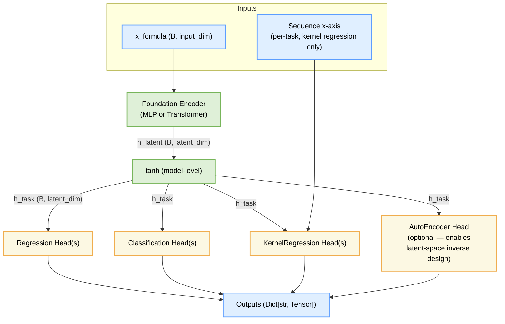

# Foundation Model for Material Properties

A multi-task learning model for predicting material properties from composition descriptors, with
gradient-based inverse design on top of the trained checkpoint.

## Model Architecture

The `FlexibleMultiTaskModel` is a modular multi-task regressor + classifier built around a shared
encoder. At the model level:

1. A **Foundation Encoder** (MLP or Transformer) maps composition descriptors → a `latent_dim`
   representation.
2. A **`torch.tanh`** at the model level provides bounded inputs (`h_task`) to the task heads.
3. A collection of **task-specific heads**:
   - **Regression** — scalar / vector targets (e.g. formation energy, klat).
   - **Classification** — discrete labels (e.g. material type), with optional per-class loss weights.
   - **Kernel Regression** — per-composition property-vs-`t` sequences (e.g. DOS density vs energy,
     power factor vs temperature).
   - **AutoEncoder** — reconstructs the input descriptor from `h_task`; required for the
     latent-space inverse-design path (see "Inverse design" below).


```mermaid
graph TD
    %% ---------- Inputs ----------
    subgraph InputsLayer["Inputs"]
        direction TB
        X["x_formula (B, input_dim)"]
        T["Sequence x-axis<br/>(per-task, kernel regression only)"]
    end

    %% ---------- Foundation encoder ----------
    FE["Foundation Encoder<br/>(MLP or Transformer)"]
    TANH["tanh (model-level)"]

    %% ---------- Task heads ----------
    REG["Regression Head(s)"]
    CLF["Classification Head(s)"]
    KR["KernelRegression Head(s)"]
    AE["AutoEncoder Head<br/>(optional — enables<br/>latent-space inverse design)"]

    %% ---------- Edges ----------
    X --> FE -- "h_latent (B, latent_dim)" --> TANH
    TANH -- "h_task (B, latent_dim)" --> REG
    TANH -- "h_task" --> CLF
    TANH -- "h_task" --> KR
    T --> KR
    TANH -- "h_task" --> AE
    REG --> O["Outputs (Dict[str, Tensor])"]
    CLF --> O
    KR --> O
    AE --> O

    %% ---------- Styles ----------
    classDef io    fill:#E0EFFF,stroke:#5C9DFF,stroke-width:2px,color:#000;
    classDef main  fill:#DFF0D8,stroke:#77B55A,stroke-width:2px,color:#000;
    classDef heads fill:#FCF8E3,stroke:#F0AD4E,stroke-width:2px,color:#000;
    class X,T io
    class FE,TANH main
    class REG,CLF,KR,AE heads
    class O io
```

For the detailed forward / loss / inverse-design diagrams, see
[**ARCHITECTURE.md**](ARCHITECTURE.md).

## Installation

```bash
git clone https://github.com/TsumiNa/foundation_model.git
cd foundation_model
uv sync --frozen --all-groups
```

This installs all dependencies pinned by `uv.lock` (production + dev) for reproducibility.
To add a new dependency: `uv add <pkg>` (runtime) or `uv add --dev <pkg>` (dev).

## Usage

There are two parallel entry points:

1. **`fm-trainer`** (PyTorch Lightning CLI, defined in [pyproject.toml](pyproject.toml) and backed
   by [`scripts/train.py`](src/foundation_model/scripts/train.py)) — YAML-driven supervised
   training of `FlexibleMultiTaskModel` on `CompoundDataModule`.
2. **`continual_rehearsal_demo` / `continual_rehearsal_full`** — TOML-driven multi-task continual
   rehearsal runners that train a sequence of tasks with small replay, then run gradient-based
   inverse design on the trained checkpoint.

### Training (YAML / LightningCLI)

```bash
fm-trainer fit --config path/to/config.yaml [--trainer.max_epochs=50]
```

or equivalently:

```bash
python -m foundation_model.scripts.train fit --config path/to/config.yaml
```

`fit` / `validate` / `test` / `predict` are the standard LightningCLI subcommands. Any field
under `model.init_args.*`, `data.init_args.*`, `trainer.*` can be overridden from the command
line. See [`samples/`](samples/) for templates.

### Continual rehearsal + inverse design (TOML)

```bash
# Demo runner — small multi-task rehearsal, saves final_model.pt, optionally runs inverse design.
python -m foundation_model.scripts.continual_rehearsal_demo \
    --config-file samples/continual_rehearsal_demo_config_inverse_baseline.toml

# Skip training, re-run only the inverse-design stage on an existing checkpoint.
python -m foundation_model.scripts.continual_rehearsal_demo \
    --config-file samples/continual_rehearsal_demo_config_inverse_baseline.toml \
    --inverse-only artifacts/inverse_design_run/training/final_model.pt
```

See the [Inverse design](#inverse-design) section below for the full pipeline.

### Configuration

Both entry points read configuration as structured objects:

- The **YAML / LightningCLI** path uses `init_args` blocks that map 1:1 onto each class's
  `__init__` parameters (model, datamodule, trainer, callbacks).
- The **TOML** path uses a single `ContinualRehearsalConfig` dataclass; unknown keys are silently
  ignored so the same TOML can drive both `continual_rehearsal_demo` and the downstream
  `paper_inverse_comparison` script.

## Features

- **Multi-task** regression + classification + kernel regression on a shared encoder.
- **Learnable per-task uncertainty** loss balancer (Kendall et al. CVPR 2018) — optional, per
  `enable_learnable_loss_balancer`. See the "Loss Weighting Strategy" section below.
- **Per-class classification weights** (`ClassificationTaskConfig.class_weights`) — keeps minority
  classes alive in imbalanced supervised tasks (e.g. the QC material-type head).
- **Task add / remove at runtime** — `model.add_task(cfg)` / `model.remove_tasks("name")` for
  continual-learning-style task sequences.
- **Optional AutoEncoder head** (`enable_autoencoder=True`) — reconstructs the input descriptor
  from `h_task`; required for `optimize_latent(optimize_space="latent")`.
- **Gradient-based inverse design** — two paths on a trained checkpoint:
  - `model.optimize_latent(...)` — descends on `h` with an AE-alignment penalty
    (`ae_align_scale ∈ [0, 1]`) that keeps the optimised latent on the AE manifold.
  - `model.optimize_composition(...)` — differentiable KMD: descends on element-weight logits
    directly, with optional element whitelist (`allowed_elements`), per-element step scaling
    (`element_step_scale`), seed-vs-uniform mix (`seed_blend`), and per-output entropy penalty
    (`diversity_scale ∈ [0, 1]`).
- **Continual rehearsal** training scripts (`continual_rehearsal_demo` / `..._full`) with small
  replay, per-step checkpoints + parquet predictions, and a fully-automated paper-grade output
  folder (figures + JSON + SUMMARY.md per inverse-design scenario).

### Loss Weighting Strategy

For supervised multi-task training, the model uses a learnable uncertainty term (Kendall, Gal,
and Cipolla, [CVPR 2018](https://doi.org/10.1109/CVPR.2018.00781)):

1. **Raw losses** — each task head supplies $\mathcal{L}_t$ (MSE / cross-entropy / sequence loss).
2. **Per-task static scaling** — each task config exposes `loss_weight` (default `1.0`) to scale
   the raw loss before combination.
3. **Optional learnable uncertainty** — when `enable_learnable_loss_balancer=True`, the model
   maintains $\log\sigma_t$ per task and scales the contribution as
   $\mathcal{L}'_t = \tfrac{1}{2}\,w_t\,\exp(-2\log\sigma_t)\,\mathcal{L}_t + \log\sigma_t$.
4. **Fallback** — when disabled, each contribution reduces to $w_t \cdot \mathcal{L}_t$.
5. **Total loss** — sum of all task contributions.

See [ARCHITECTURE.md § Loss Calculation](ARCHITECTURE.md#loss-calculation-and-weighting) for the
walk-through.

## Data Handling

- Per-task data files joined by a shared **composition** column.
- Missing values masked rather than dropped (per-task masks in `y_dict`).
- Configurable train/val/test splits, descriptor caching, per-task `task_masking_ratio` for
  scaling-law experiments.

### Input data — composition-keyed per-task sources

`CompoundDataModule` is composition-keyed: each task owns its own data file(s), joined to the
others by a shared **composition** column. There is no monolithic attributes file — adding a new
property task means adding one file plus one task config. Descriptors are computed on demand from
the union of compositions via a user-supplied `descriptor_fn` (results are cached per unique
composition).

**DataModule wiring** (YAML):

```yaml
data:
  class_path: foundation_model.data.datamodule.CompoundDataModule
  init_args:
    descriptor_fn:
      class_path: foundation_model.data.composition_sources.PrecomputedDescriptorSource
      init_args:
        path: "data/descriptors.parquet"
        composition_column: null  # null => use the file's index as the composition key
    composition_column: "composition"
    val_split: 0.1
    test_split: 0.1
    random_seed: 42
    batch_size: 64
```

**Per-task data** is configured on each task config (`BaseTaskConfig`):

| Field | Purpose |
|-------|---------|
| `data_files` | This task's own source file(s) (`csv` / `parquet` / `pd.xz` / `pkl`), concatenated by rows |
| `data_column` | Column inside that file holding the target values |
| `t_column` | (Kernel regression) column holding the sequence x-axis (energy / temperature / time) |
| `composition_column` | Per-task override of the global composition column |
| `split_column` | Optional in-file `train` / `val` / `test` labels (default `"split"`) |
| `task_masking_ratio` | Optional keep-ratio applied to this task's valid training samples |
| `predict_idx` | Composition subset to predict: `train`/`val`/`test`/`all` or an explicit list |

```yaml
# In model.init_args.task_configs (linked into the datamodule automatically):
- name: band_gap
  type: REGRESSION
  data_files: "data/band_gap.parquet"
  data_column: "Band gap"
- name: dos
  type: KernelRegression
  data_files: "data/dos.parquet"
  data_column: "DOS density"
  t_column: "DOS energy"
```

**Splitting.** A single composition-level train/val/test split is derived by overlaying every
task file's `split` column (precedence `test > val > train`; conflicts warn). Compositions
without a label fall back to a representation-aware random split (`MultiTaskSplitter`) that
prioritises rare tasks. `test_all=True` assigns everything to test.

**Prediction.** Each task's `predict_idx` selects a composition subset; the predict set is their
union, exposed as `datamodule.predict_compositions`.

**Important.** Composition keys must match exactly across files; list-valued cells in CSV must be
strings parseable by `ast.literal_eval` (e.g. `"[1.0, 2.5, 3.0]"`); missing data is masked
per-task; compositions without a valid descriptor are dropped with a warning.

## Quick Examples

### Example 1 — Supervised training

```bash
fm-trainer fit --config path/to/config.yaml --trainer.max_epochs=60
```

```yaml
seed_everything: 42
model:
  class_path: foundation_model.models.FlexibleMultiTaskModel
  init_args:
    encoder_config:
      type: mlp
      hidden_dims: [128, 256, 128]   # first = input_dim, last = latent_dim
      norm: true
    task_configs:
      - name: example_task
        type: REGRESSION
        dims: [128, 64, 1]
        data_column: my_property
        loss_weight: 0.8
data:
  class_path: foundation_model.data.datamodule.CompoundDataModule
  init_args:
    descriptor_fn:
      class_path: foundation_model.data.composition_sources.PrecomputedDescriptorSource
      init_args: { path: "data/descriptors.parquet", composition_column: null }
    composition_column: "composition"
    batch_size: 64
trainer:
  max_epochs: 60
```

### Example 2 — Freeze the encoder, fine-tune only task heads

```bash
fm-trainer fit --config path/to/config.yaml \
    --model.init_args.shared_block_optimizer.freeze_parameters=True
```

`shared_block_optimizer.freeze_parameters` is the model-level knob that locks all encoder
parameters. Use this for head-only fine-tuning on a pre-trained checkpoint.

For a more surgical freeze (encoder + every head NOT in a chosen list + the per-task loss
balancer scalars) see [`scripts/finetune_inverse_heads.py`](src/foundation_model/scripts/finetune_inverse_heads.py).

### Example 3 — Transformer encoder

```yaml
model:
  init_args:
    encoder_config:
      type: transformer
      input_dim: 128
      d_model: 256
      num_layers: 4
      nhead: 4
      dropout: 0.1
      use_cls_token: true
      apply_layer_norm: true
```

Both `[CLS]` and mean-pooling aggregations keep every feature token in play for the supervised
loss (gradients reach all tokens through self-attention).

### Example 4 — Scaling-law experiment via `task_masking_ratio`

Each task's `task_masking_ratio` controls the fraction of its valid training samples used (`1.0`
= all, `0.5` = half). Re-run training with `task_A.task_masking_ratio` set to `1.0`, `0.5`,
`0.2` in turn and record the final `val_task_A_*` loss — as the ratio drops, validation loss for
that task rises (the scaling-law signal) while other tasks are unaffected.

```yaml
task_configs:
  - name: task_A
    type: REGRESSION
    data_files: "examples/data/task_A.csv"
    data_column: "target_A"
    dims: [256, 64, 1]
    task_masking_ratio: 1.0   # vary this to study the scaling law
```

## Inverse design

After training, the same `FlexibleMultiTaskModel` exposes two gradient-based inverse-design
entry points on the model:

| Method | Optimisation variable | Output is the recipe? | Method-specific knob |
|---|---|---|---|
| `optimize_latent(optimize_space="latent")` | the latent $h$ | no — needs AE decode | `ae_align_scale ∈ [0, 1]` (default 0.5; pulls $h$ onto the AE manifold) |
| `optimize_composition` | element-weight logits $\theta$, with $w = \text{softmax}(\theta)$ | yes — $w$ is the recipe | `diversity_scale ∈ [0, 1]` (default 1.0; per-output entropy penalty) |

`optimize_composition` further accepts an orthogonal constraint surface (full docstrings on
the method; design notes in
[docs/inverse_design_extension_notes.md](docs/inverse_design_extension_notes.md)):

- `max_elements: int` — cardinality cap (at most K non-zero elements per recipe), enforced
  through a differentiable iterative-softmax K-hot mask with a single `annealing_scale ∈ [0, 1]`
  softness knob (default 0.5 = the calibrated safe choice).
- `fixed_amounts: {symbol: float}` — pin specific elements at user-given absolute amounts
  (e.g. `{"Au": 0.65, "Ga": 0.20}`); the optimiser distributes the remaining mass freely.
- `min_nonzero_weight: float` — reject trace-amount appearances (e.g. drop anything below
  10 %), with safe-fallback so the simplex invariant is always preserved.

All three compose orthogonally with each other and with `allowed_elements` / `element_step_scale`.

Both methods share the same regression-MSE + classification-cross-entropy backbone; only the
third loss term and the optimisation variable differ. **Reference:**
[docs/inverse_design_algorithms.md](docs/inverse_design_algorithms.md).

### End-to-end pipeline (PR #18)

`continual_rehearsal_demo` / `continual_rehearsal_full` train an 11-task or 24-task multi-task
model with small replay, then run inverse design on the trained checkpoint:

```bash
# 1. Baseline continual rehearsal — saves training/final_model.pt under the output dir.
python -m foundation_model.scripts.continual_rehearsal_demo \
    --config-file samples/continual_rehearsal_demo_config_inverse_baseline.toml

# 2. Targeted retrain of the three inverse-design heads on top of the checkpoint.
python -m foundation_model.scripts.finetune_inverse_heads \
    --config-file samples/continual_rehearsal_demo_config_inverse_baseline.toml \
    --checkpoint artifacts/inverse_design_run/training/final_model.pt \
    --output-dir artifacts/inverse_design_run/finetune

# 3. Per-scenario sweep — 3 scenarios × 8 paths (latent α-sweep + 5 composition configs).
python -m foundation_model.scripts.paper_inverse_3scenarios \
    --config-file samples/continual_rehearsal_demo_config_inverse_baseline.toml \
    --checkpoint artifacts/inverse_design_run/finetune/final_model.pt \
    --output-dir artifacts/inverse_design_run/inverse_design
```

Each scenario folder ends up with `comparison.png` (bar chart), `element_frequency_heatmap.png`
(per-method × top-K elements with newly-discovered elements highlighted),
`qc_vs_secondary_scatter.png` (per-seed cloud with the seed-baseline layer), and 7×
`seed_to_optimized__*.png` (per-path 1:1 mapping), plus `results.json` + `SUMMARY.md`.

For the headline messages from the 3-scenario sweep (multi-objective optimisation, element
discovery, comparison of the two paths, conflicting-objective trade-offs), see
[docs/qc_inverse_design_summary.md](docs/qc_inverse_design_summary.md).

## Update History

See [CHANGES.md](CHANGES.md).
