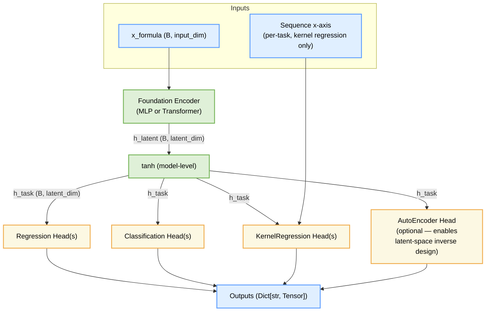

# Foundation Model for Material Properties

A multi-task learning model for predicting material properties from composition descriptors, with
gradient-based inverse design on top of the trained checkpoint.

## Model Architecture

The `FlexibleMultiTaskModel` is a modular multi-task regressor + classifier built around a shared
encoder. At the model level:

1. A **Foundation Encoder** (MLP or Transformer) maps composition descriptors → a `latent_dim`
   representation.
2. A **`torch.tanh`** at the model level provides bounded inputs (`h_task`) to the task heads.
3. A collection of **task-specific heads**:
   - **Regression** — scalar / vector targets (e.g. formation energy, klat).
   - **Classification** — discrete labels (e.g. material type), with optional per-class loss weights.
   - **Kernel Regression** — per-composition property-vs-`t` sequences (e.g. DOS density vs energy,
     power factor vs temperature).
   - **AutoEncoder** — reconstructs the input descriptor from `h_task`; required for the
     latent-space inverse-design path (see "Inverse design" below).


```mermaid
graph TD
    %% ---------- Inputs ----------
    subgraph InputsLayer["Inputs"]
        direction TB
        X["x_formula (B, input_dim)"]
        T["Sequence x-axis<br/>(per-task, kernel regression only)"]
    end

    %% ---------- Foundation encoder ----------
    FE["Foundation Encoder<br/>(MLP or Transformer)"]
    TANH["tanh (model-level)"]

    %% ---------- Task heads ----------
    REG["Regression Head(s)"]
    CLF["Classification Head(s)"]
    KR["KernelRegression Head(s)"]
    AE["AutoEncoder Head<br/>(optional — enables<br/>latent-space inverse design)"]

    %% ---------- Edges ----------
    X --> FE -- "h_latent (B, latent_dim)" --> TANH
    TANH -- "h_task (B, latent_dim)" --> REG
    TANH -- "h_task" --> CLF
    TANH -- "h_task" --> KR
    T --> KR
    TANH -- "h_task" --> AE
    REG --> O["Outputs (Dict[str, Tensor])"]
    CLF --> O
    KR --> O
    AE --> O

    %% ---------- Styles ----------
    classDef io    fill:#E0EFFF,stroke:#5C9DFF,stroke-width:2px,color:#000;
    classDef main  fill:#DFF0D8,stroke:#77B55A,stroke-width:2px,color:#000;
    classDef heads fill:#FCF8E3,stroke:#F0AD4E,stroke-width:2px,color:#000;
    class X,T io
    class FE,TANH main
    class REG,CLF,KR,AE heads
    class O io
```

For the detailed forward / loss / inverse-design diagrams, see
[**ARCHITECTURE.md**](ARCHITECTURE.md).

## Installation

```bash
git clone https://github.com/TsumiNa/foundation_model.git
cd foundation_model
uv sync --frozen --all-groups
```

This installs all dependencies pinned by `uv.lock` (production + dev) for reproducibility.
To add a new dependency: `uv add <pkg>` (runtime) or `uv add --dev <pkg>` (dev).

See [docs/container.md](docs/container.md) for the default x86-64 CUDA 13 and RIKYU AArch64 images.
RIKYU-specific Apptainer details are in [docs/rikyu_container.md](docs/rikyu_container.md).

## Usage

Everything runs through a single console command, **`fm`**, with four subcommands. Each reads a
TOML config and writes `run_provenance.json` + `run.log` into its output directory.

```bash
# 1. Replay-based continual pre-training (interval replay, optional n_runs sweep).
fm pretrain --config samples/pretrain.toml

# 2. Frozen-encoder fine-tuning of selected heads on a checkpoint.
fm finetune --config samples/finetune.toml \
    --checkpoint artifacts/pretrain/training/final_model.pt

# 3. Inverse design (scenarios × latent/composition algorithm paths).
fm inverse  --config samples/inverse.toml \
    --checkpoint artifacts/finetune/training/final_model.pt

# 4. Evaluate / predict with an arbitrary checkpoint.
fm predict  --config samples/predict.toml \
    --checkpoint artifacts/finetune/training/final_model.pt
```

Every subcommand accepts the common flags `--config` (required), `--output-dir`,
`--set section.key=value` (repeatable; the value is parsed with TOML semantics, so quote strings:
`--set 'data.composition_column="composition"'`), `--seed`, `--accelerator`, and `--sample` (cap
rows for a fast smoke run). `*_smoke.toml` companions under [`samples/`](samples/) run the whole
chain end-to-end on CPU in minutes.

### Configuration

All configs are **TOML**, normalized into validated `@dataclass` config objects by the
per-subcommand `build_*_config` builders. Configs share the `[data]` / `[descriptor]` /
`[datasets.*]` / `[[tasks]]` / `[model]` / `[training]` sections and add one subcommand section
(`[pretrain]` / `[finetune]` / `[inverse]` / `[predict]`). Unknown keys are rejected with the
offending key name.

`[model]` sets the network depth + per-layer widths as `*_hidden_dims` lists — the interior hidden
widths, with the input (descriptor width for the encoder, `latent_dim` for the heads) prepended and
the output (1 / `num_classes` / kernel projection) appended. So `encoder_hidden_dims = [512, 256]`
builds `descriptor_dim → 512 → 256 → latent_dim`. Defaults: `encoder_hidden_dims`, `head_hidden_dims`
(reg/clf), `kr_x_hidden_dims` / `kr_t_hidden_dims` / `n_kernel` (KR). Any `[[tasks]]` entry may
override its own head — `hidden_dims` for reg/clf, `x_hidden_dims` / `t_hidden_dims` / `n_kernel` for
KR — falling back to the `[model]` defaults when unset.

Training callbacks and loggers map to Lightning's built-ins via `[training]` sub-tables (a flexible
subset of each): `[training.early_stopping]` → `EarlyStopping` (on by default),
`[training.checkpoint]` → `ModelCheckpoint`, and `[training.logging]` (`csv` / `tensorboard`) →
`CSVLogger` / `TensorBoardLogger`. Lightning checkpointing/logging are opt-in; the run recorder
writes the replay-schema checkpoints + `run.log` regardless.

**[`docs/configuration.md`](docs/configuration.md) is the authoritative schema** — every section,
key, type, default, constraint, and which subcommands read it. See [`samples/`](samples/) for
ready-to-copy templates.

## Features

- **Multi-task** regression + classification + kernel regression on a shared encoder.
- **Learnable per-task uncertainty** loss balancer (Kendall et al. CVPR 2018) — optional, per
  `enable_learnable_loss_balancer`. See the "Loss Weighting Strategy" section below.
- **Per-class classification weights** (`ClassificationTaskConfig.class_weights`) — keeps minority
  classes alive in imbalanced supervised tasks (e.g. the QC material-type head).
- **Task add / remove at runtime** — `model.add_task(cfg)` / `model.remove_tasks("name")` for
  continual-learning-style task sequences.
- **Optional AutoEncoder head** (`enable_autoencoder=True`) — reconstructs the input descriptor
  from `h_task`; required for `optimize_latent(optimize_space="latent")`.
- **Gradient-based inverse design** — two paths on a trained checkpoint:
  - `model.optimize_latent(...)` — descends on `h` with an AE-alignment penalty
    (`ae_align_scale ∈ [0, 1]`) that keeps the optimised latent on the AE manifold.
  - `model.optimize_composition(...)` — differentiable KMD: descends on element-weight logits
    directly, with optional element whitelist (`allowed_elements`), per-element step scaling
    (`element_step_scale`), seed-vs-uniform mix (`seed_blend`), and per-output entropy penalty
    (`diversity_scale ∈ [0, 1]`).
- **Replay-based continual pre-training** (`fm pretrain`) with interval replay, per-step
  checkpoints + parquet predictions, forgetting-trajectory plots, and an optional `n_runs` sweep;
  inverse design (`fm inverse`) produces a paper-grade output folder (figures + JSON + SUMMARY.md
  per scenario).

### Loss Weighting Strategy

For supervised multi-task training, the model uses a learnable uncertainty term (Kendall, Gal,
and Cipolla, [CVPR 2018](https://doi.org/10.1109/CVPR.2018.00781)):

1. **Raw losses** — each task head supplies $\mathcal{L}_t$ (MSE / cross-entropy / sequence loss).
2. **Per-task static scaling** — each task config exposes `loss_weight` (default `1.0`) to scale
   the raw loss before combination.
3. **Optional learnable uncertainty** — when `enable_learnable_loss_balancer=True`, the model
   maintains $\log\sigma_t$ per task and scales the contribution as
   $\mathcal{L}'_t = \tfrac{1}{2}\,w_t\,\exp(-2\log\sigma_t)\,\mathcal{L}_t + \log\sigma_t$.
4. **Fallback** — when disabled, each contribution reduces to $w_t \cdot \mathcal{L}_t$.
5. **Total loss** — sum of all task contributions.

See [ARCHITECTURE.md § Loss Calculation](ARCHITECTURE.md#loss-calculation-and-weighting) for the
walk-through.

## Data Handling

- Per-task data files joined by a shared **composition** column.
- Missing values masked rather than dropped (per-task masks in `y_dict`).
- Configurable train/val/test splits and descriptor caching.

### Input data — composition-keyed per-task sources

`CompoundDataModule` is composition-keyed: each task owns its own data file(s), joined to the
others by a shared **composition** column. There is no monolithic attributes file — adding a new
property task means adding one file plus one task config. Descriptors are computed on demand from
the union of compositions via a user-supplied `descriptor_fn` (results are cached per unique
composition).

**Wiring it** — `[data]` holds the loader/split settings, `[descriptor]` says how descriptors are
produced, and each data file gets a `[datasets.<name>]` table that tasks reference by name:

```toml
[data]
composition_column = "composition"
val_split = 0.1
test_split = 0.1
split_random_seed = 42
batch_size = 64

[descriptor]
kind = "precomputed"          # or "kmd" for the on-the-fly invertible descriptor
path = "data/descriptors.parquet"

[datasets.band_gap]
path = "data/band_gap.parquet"

[datasets.dos]
path = "data/dos.parquet"

[[tasks]]
name = "band_gap"
kind = "regression"
dataset = "band_gap"
column = "Band gap"

[[tasks]]
name = "dos"
kind = "kernel_regression"
dataset = "dos"
column = "DOS density"
t_column = "DOS energy"
```

**Python-layer field names differ from the TOML keys.** `BaseTaskConfig` is what the model
consumes; the config layer builds it from `[datasets.*]` + `[[tasks]]`. When reading the source,
this is the mapping:

| `BaseTaskConfig` field | TOML equivalent | Notes |
|---|---|---|
| `data_files` | `[datasets.<name>].path`, selected by `[[tasks]].dataset` | TOML groups tasks under named datasets instead of repeating a path per task |
| `data_column` | `[[tasks]].column` | |
| `t_column` | `[[tasks]].t_column` | Kernel regression only |
| `composition_column` | `[data].composition_column` | Global in TOML; the per-task override is Python-only |
| `split_column` | — | Honoured inside the data file (a `split` column); not a TOML key |
| `task_masking_ratio` | — | **Not exposed**; every workflow call site passes `1.0` (see Example 4) |
| `predict_idx` | — | Python-only; the CLI predicts the configured subset |

**Splitting.** A single composition-level train/val/test split is derived by overlaying every
task file's `split` column (precedence `test > val > train`; conflicts warn). Compositions
without a label fall back to a representation-aware random split (`MultiTaskSplitter`) that
prioritises rare tasks. `test_all=True` assigns everything to test.

**Prediction.** Each task's `predict_idx` selects a composition subset; the predict set is their
union, exposed as `datamodule.predict_compositions`.

**Important.** Composition keys must match exactly across files; list-valued cells in CSV must be
strings parseable by `ast.literal_eval` (e.g. `"[1.0, 2.5, 3.0]"`); missing data is masked
per-task; compositions without a valid descriptor are dropped with a warning.

## Quick Examples

### Example 1 — Pre-training

```bash
fm pretrain --config samples/pretrain_smoke.toml --max-epochs 60
```

```toml
# minimal single-task config (see samples/pretrain.toml for the full template)
[descriptor]
kind = "kmd"           # on-the-fly, invertible KMD-1d descriptors
n_grids = 8

[datasets.qc]
path = "data/my_dataset.parquet"

[[tasks]]
name = "example_task"
kind = "regression"
dataset = "qc"
column = "my_property"

[model]
latent_dim = 128
encoder_hidden_dims = [256]

[training]
max_epochs = 60

[pretrain]
task_sequence = ["example_task"]

[output]
dir = "artifacts/example"
```

### Example 2 — Freeze the encoder, fine-tune only task heads

```bash
fm finetune --config samples/finetune_smoke.toml \
    --checkpoint artifacts/pretrain/training/final_model.pt --tasks formation_energy
```

`fm finetune` freezes the encoder (`freeze_encoder = true`, the default) and every head not in
`finetune.tasks`, keeping the built-in autoencoder head trainable; the loss-balancer scalars
(`task_log_sigmas`) are frozen so the objective weighting can't drift.

### Example 3 — Transformer encoder (model layer only, not selectable from TOML)

`TransformerEncoderConfig` exists in the model layer and `FlexibleMultiTaskModel` accepts it, so
it is reachable when constructing the model in Python:

```python
from foundation_model.models.model_config import TransformerEncoderConfig

encoder_config = TransformerEncoderConfig(
    input_dim=128, d_model=256, num_layers=4, nhead=4, dropout=0.1,
    use_cls_token=True, apply_layer_norm=True,
)
```

Both `[CLS]` and mean-pooling aggregations keep every feature token in play for the supervised
loss (gradients reach all tokens through self-attention).

**The `fm` CLI cannot select it.** `[model]` describes an MLP encoder only — the workflow layer's
`build_encoder_config` always returns an `MLPEncoderConfig` built from `encoder_hidden_dims` and
`latent_dim`. Wiring the transformer through to TOML is unimplemented, not merely undocumented.

### Example 4 — Scaling-law experiments

`BaseTaskConfig.task_masking_ratio` controls the fraction of a task's valid training samples used
(`1.0` = all, `0.5` = half), and drives the scaling-law signal: as the ratio drops, that task's
validation loss rises while the others are unaffected.

**It is not exposed on `[[tasks]]`.** Every workflow call site passes `masking_ratio=1.0`, so a
TOML config cannot vary it; it is settable only when building task configs in Python. From the
CLI the available data-size knob is `[datasets.<name>].sample` (or `--sample`), which caps rows
for a whole dataset rather than for one task.

A worked scaling-law study driven entirely from the CLI lives in
[`experiments/rikyu_task_scaling/`](experiments/rikyu_task_scaling/).

## Inverse design

After training, the same `FlexibleMultiTaskModel` exposes two gradient-based inverse-design
entry points on the model:

| Method | Optimisation variable | Output is the recipe? | Method-specific knob |
|---|---|---|---|
| `optimize_latent(optimize_space="latent")` | the latent $h$ | no — needs AE decode | `ae_align_scale ∈ [0, 1]` (default 0.5; pulls $h$ onto the AE manifold) |
| `optimize_composition` | element-weight logits $\theta$, with $w = \text{softmax}(\theta)$ | yes — $w$ is the recipe | `diversity_scale ∈ [0, 1]` (default 1.0; per-output entropy penalty) |

`optimize_composition` further accepts an orthogonal constraint surface (full docstrings on
the method; algorithm reference in
[docs/inverse_design_algorithms.md](docs/inverse_design_algorithms.md)):

- `max_elements: int` — cardinality cap (at most K non-zero elements per recipe), enforced
  through a differentiable iterative-softmax K-hot mask with a single `annealing_scale ∈ [0, 1]`
  softness knob (default 0.5 = the calibrated safe choice).
- `fixed_amounts: {symbol: float}` — pin specific elements at user-given absolute amounts
  (e.g. `{"Au": 0.65, "Ga": 0.20}`); the optimiser distributes the remaining mass freely.
- `min_nonzero_weight: float` — reject trace-amount appearances (e.g. drop anything below
  10 %), with safe-fallback so the simplex invariant is always preserved.

All three compose orthogonally with each other and with `allowed_elements` / `element_step_scale`.

Both methods share the same user-specified objective backbone — a list of targets (regression
value or direction high/low, kernel-regression target curves, classification label(s)
probability high/low), each with its own weight; only the method-specific loss term and the
optimisation variable differ. **Reference:**
[docs/inverse_design_algorithms.md](docs/inverse_design_algorithms.md).

### End-to-end pipeline

Pre-train a multi-task model, optionally sharpen the inverse-design heads, then run inverse
design on the checkpoint:

```bash
# 1. Replay-based continual pre-training — saves training/final_model.pt under the output dir.
fm pretrain --config samples/pretrain.toml

# 2. (Optional) targeted frozen-encoder fine-tune of the inverse-design heads.
fm finetune --config samples/finetune.toml \
    --checkpoint artifacts/pretrain/training/final_model.pt

# 3. Per-scenario sweep — 3 scenarios × the 11 default paths (3 latent α + 8 composition configs).
fm inverse  --config samples/inverse.toml \
    --checkpoint artifacts/finetune/training/final_model.pt
```

Each scenario folder ends up with `comparison.png` (bar chart: objective score + one panel per
target), `element_frequency_heatmap.png` (per-path × top-K elements with newly-discovered
elements highlighted), `objective_vs_targets_scatter.png` (per-seed cloud with the seed-baseline
layer), and
`seed_to_optimized__<path>.png` (per-path 1:1 mapping — each seed next to what the optimiser made
of it, element symbols coloured by how often that path reached for them, and every target's
channel value with its change from the seed), plus `scenario.json` / `results.json` /
`summary.json` + `SUMMARY.md` and per-path trajectory `.npz` (+ static/animated plots).

For the headline messages from the 3-scenario sweep (multi-objective optimisation, element
discovery, comparison of the two paths, conflicting-objective trade-offs), see
[docs/qc_inverse_design_summary.md](docs/qc_inverse_design_summary.md).

## Update History

See [CHANGES.md](CHANGES.md).
